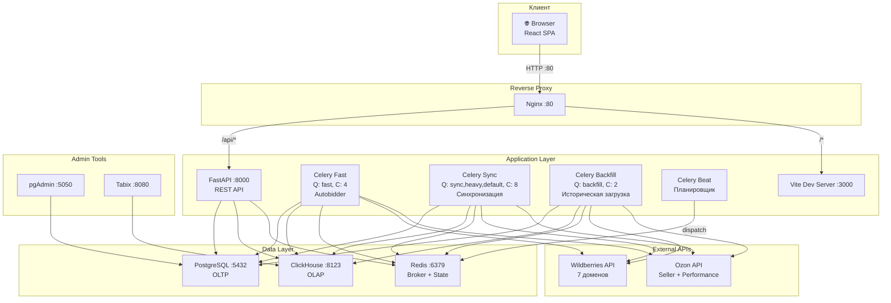
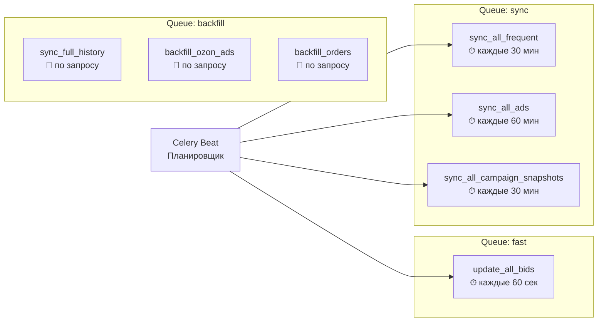
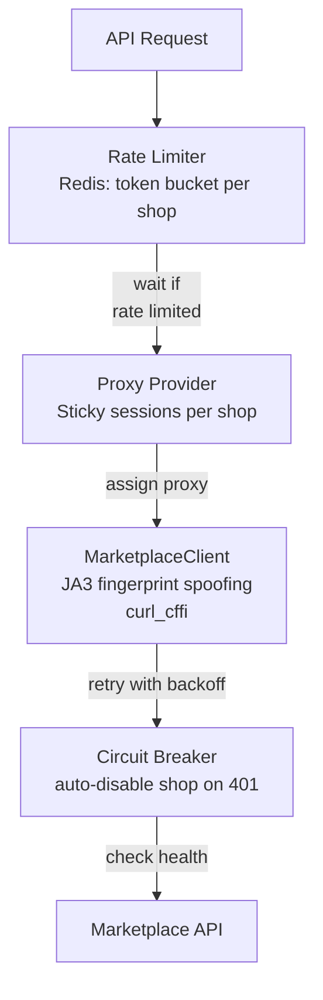
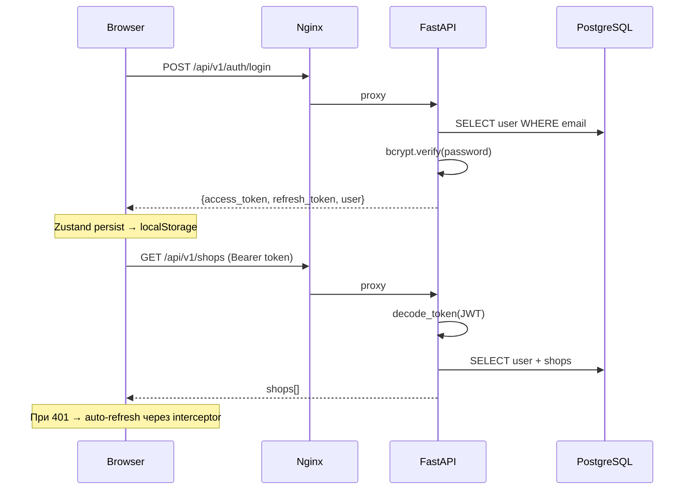
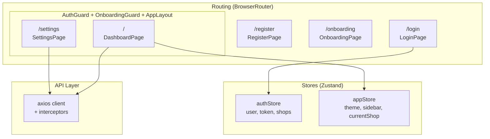
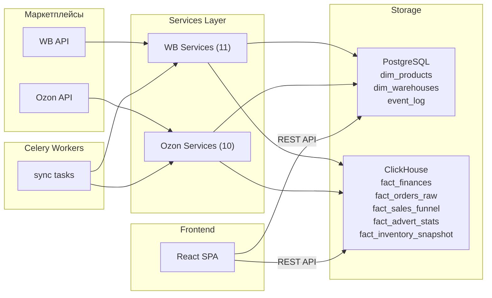

# MP-CONTROL — Архитектурный обзор

> **MMS (Marketplace Management System)** — платформа для автоматизации аналитики и управления рекламой на маркетплейсах Wildberries и Ozon.

## Назначение системы

MP-CONTROL решает три ключевые задачи:

1. **Сбор данных** — периодическая синхронизация через API маркетплейсов (продажи, финансы, реклама, остатки, воронка)
2. **Аналитика** — хранение и агрегация данных в ClickHouse для быстрых OLAP-запросов
3. **Управление** — автоматический биддинг рекламы (autobidder), мониторинг событий, управление магазинами

---

## Стек технологий

| Слой                 | Технология                   | Назначение                                                  |
| -------------------- | ---------------------------- | ----------------------------------------------------------- |
| **Backend API**      | FastAPI + asyncpg            | REST API, валидация, аутентификация                         |
| **Task Queue**       | Celery + Redis (broker)      | Фоновые задачи: синхронизация, backfill, autobidder         |
| **OLTP Database**    | PostgreSQL 15                | Пользователи, магазины, настройки, справочники              |
| **OLAP Database**    | ClickHouse                   | Аналитика: заказы, финансы, реклама, воронка, остатки       |
| **State/Cache**      | Redis 7                      | Celery broker, rate limiting, deduplication, campaign state |
| **Frontend**         | React 18 + Vite + TypeScript | SPA с dark/light темой                                      |
| **State Mgmt**       | Zustand (persist)            | authStore (JWT + shops), appStore (тема, sidebar, shop)     |
| **HTTP Client**      | Axios + interceptors         | Auto-refresh JWT, auto-token injection                      |
| **Reverse Proxy**    | Nginx                        | Роутинг /api → backend, / → frontend                        |
| **Containerization** | Docker Compose               | 12 сервисов в единой сети                                   |

---

## Высокоуровневая архитектура

---

## Docker-сервисы (12 контейнеров)

| Контейнер             | Image                    | Порт       | Назначение                                       |
| --------------------- | ------------------------ | ---------- | ------------------------------------------------ |
| `mms-backend`         | Custom (FastAPI)         | 8000       | REST API                                         |
| `mms-celery-fast`     | Custom                   | —          | Autobidder, позиции (каждую минуту)              |
| `mms-celery-sync`     | Custom                   | —          | Синхронизация данных (каждые 15–60 мин)          |
| `mms-celery-backfill` | Custom                   | —          | Историческая загрузка (при подключении магазина) |
| `mms-celery-beat`     | Custom                   | —          | Планировщик периодических задач                  |
| `mms-frontend`        | Custom (Vite)            | 3000       | React SPA (dev mode)                             |
| `mms-nginx`           | Custom                   | **80**     | Reverse proxy (единая точка входа)               |
| `mms-postgres`        | postgres:15-alpine       | 5455       | Транзакционная БД                                |
| `mms-clickhouse`      | clickhouse-server:latest | 8123, 9000 | Аналитическая БД                                 |
| `mms-redis`           | redis:7-alpine           | 6379       | Broker + кэш + state                             |
| `mms-pgadmin`         | pgadmin4:latest          | 5050       | Web-GUI для PostgreSQL                           |
| `mms-tabix`           | tabix:stable             | 8080       | Web-GUI для ClickHouse                           |

---

## Celery — очереди и расписание

### 3 очереди (3 воркера)

| Очередь    | Воркер          | Concurrency | Задачи                                                                              |
| ---------- | --------------- | ----------- | ----------------------------------------------------------------------------------- |
| `fast`     | celery-fast     | 4           | autobidder (update_bids) — каждые 60 сек                                            |
| `sync`     | celery-sync     | 8           | sync_all_frequent (30 мин), sync_all_ads (60 мин), sync_campaign_snapshots (30 мин) |
| `backfill` | celery-backfill | 2           | sync_full_history, backfill_ozon_ads, backfill_orders — при подключении магазина    |

### Дедупликация задач

Используется Redis-based dedup (`_dedup_dispatch`): перед отправкой задачи ставится NX-ключ с TTL. Если ключ существует — задача уже в очереди/выполняется, повторная не ставится.

---

## Anti-Ban система

Три уровня защиты от блокировок API:

| Модуль                | Файл                         | Что делает                                            |
| --------------------- | ---------------------------- | ----------------------------------------------------- |
| **Rate Limiter**      | `core/rate_limiter.py`       | Token bucket в Redis, лимит req/мин на магазин        |
| **Proxy Provider**    | `core/proxy_provider.py`     | Ротация прокси, sticky sessions (один прокси на shop) |
| **Circuit Breaker**   | `core/circuit_breaker.py`    | Автоотключение магазина при 401 (невалидный ключ)     |
| **MarketplaceClient** | `core/marketplace_client.py` | Единый HTTP-клиент: JA3 spoofing, retry, logging      |

---

## Аутентификация

| Механизм     | Деталь                                                  |
| ------------ | ------------------------------------------------------- |
| Хеширование  | bcrypt (прямой, без passlib)                            |
| JWT          | HS256, access: 120 мин, refresh: 7 дней                 |
| Frontend     | Zustand с `persist` → `localStorage`                    |
| Auto-refresh | Axios interceptor: при 401 → POST /auth/refresh → retry |

---

## Шифрование API-ключей

API-ключи маркетплейсов хранятся в PostgreSQL в зашифрованном виде:

- **Модуль:** `core/encryption.py`
- **Алгоритм:** Fernet (симметричное шифрование, AES-128-CBC)
- **Ключ:** Выводится из `SECRET_KEY` через PBKDF2
- **Поля:** `Shop.api_key_encrypted`, `Shop.perf_client_secret_encrypted`

---

## Redis — роли

Redis используется для 5 различных целей:

| Роль               | Ключи                             | Описание                                    |
| ------------------ | --------------------------------- | ------------------------------------------- |
| **Celery Broker**  | `celery-task-meta-*`              | Очереди задач                               |
| **Task Dedup**     | `task_lock:{task}:{shop_id}`      | NX-ключи с TTL для предотвращения дублей    |
| **Rate Limiting**  | `rate_limit:{shop_id}`            | Token bucket: остаток токенов + timestamp   |
| **Campaign State** | `ads:state:{shop_id}:{advert_id}` | Хеши: cpm, status, items, type              |
| **Content State**  | `content:{shop_id}:{nm_id}`       | Хеши: price, stock, image_url, content_hash |

---

## Frontend — структура

| Файл                  | Назначение                                                              |
| --------------------- | ----------------------------------------------------------------------- |
| `App.tsx`             | Роутинг: публичные (login, register) + защищённые (dashboard, settings) |
| `AuthGuard.tsx`       | HOC: редирект на /login если нет токена                                 |
| `OnboardingGuard.tsx` | HOC: редирект на /onboarding если нет магазинов                         |
| `AppLayout.tsx`       | Sidebar + Header + content area                                         |
| `authStore.ts`        | JWT, user, shops — persist в localStorage                               |
| `appStore.ts`         | Тема (dark/light), sidebar, текущий магазин                             |
| `client.ts`           | Axios + auto-Bearer + auto-refresh при 401                              |

---

## Wildberries API — 7 доменов

| Домен           | Base URL                              | Сервисы                   |
| --------------- | ------------------------------------- | ------------------------- |
| Content API     | `content-api.wildberries.ru`          | Карточки товаров, фото    |
| Statistics API  | `statistics-api.wildberries.ru`       | Заказы, продажи           |
| Marketplace API | `marketplace-api.wildberries.ru`      | Остатки, склады           |
| Advert API      | `advert-api.wildberries.ru`           | Реклама: кампании, ставки |
| Prices API      | `discounts-prices-api.wildberries.ru` | Цены, скидки              |
| Analytics API   | `seller-analytics-api.wildberries.ru` | Воронка продаж            |
| Supplier API    | `supplier-api.wildberries.ru`         | Финансовые отчёты         |

## Ozon API — 2 домена

| Домен           | Base URL                  | Сервисы                          |
| --------------- | ------------------------- | -------------------------------- |
| Seller API      | `api-seller.ozon.ru`      | Товары, заказы, финансы, остатки |
| Performance API | `api-performance.ozon.ru` | Рекламные кампании (OAuth2)      |

---

## Поток данных (высокий уровень)

---

## Дальнейшие документы

| Документ                                                                                            | Содержание                                             |
| --------------------------------------------------------------------------------------------------- | ------------------------------------------------------ |
| [02_DATA_MODEL.md](file:///Users/alex/Documents/Репы/MP-CONTROL/docs/architecture/02_DATA_MODEL.md) | Все таблицы PostgreSQL + ClickHouse: поля, типы, связи |
| 03_CELERY_PIPELINE.md                                                                               | Все задачи, координаторы, потоки данных                |
| 04_BACKEND_API.md                                                                                   | REST endpoints, request/response schemas               |
| 05_SERVICES.md                                                                                      | 21 сервис: API endpoints, transformation, storage      |
| 06_FRONTEND.md                                                                                      | Компоненты, stores, UI-система                         |
| 07_INFRASTRUCTURE.md                                                                                | Docker, env, nginx, деплой                             |
