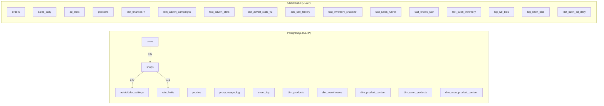

# MP-CONTROL — Модель данных

> Все таблицы, связи и принципы хранения.  
> Файлы-источники: `docker/postgres/init.sql`, `docker/clickhouse/init.sql`

---

## Архитектура хранения (двойная БД)



### Принципы разделения

| Что                       | Где        | Почему                                    |
| ------------------------- | ---------- | ----------------------------------------- |
| Учётные записи, ключи API | PostgreSQL | ACID, аутентификация, малый объём         |
| Справочники товаров       | PostgreSQL | Обновляются in-place (UPSERT), нужны JOIN |
| Временные ряды, факты     | ClickHouse | Миллионы строк, OLAP-агрегации, TTL       |
| Настройки, конфиг         | PostgreSQL | Транзакционная целостность                |

---

## PostgreSQL — 12 таблиц

### ER-диаграмма

```mermaid
erDiagram
    users ||--o{ shops : "owns"
    shops ||--o| autobidder_settings : "has"
    shops ||--o| rate_limits : "has"
    shops ||--o{ proxy_usage_log : "logged"
    proxies ||--o{ proxy_usage_log : "used_by"

    users {
        UUID id PK
        VARCHAR email UK
        VARCHAR hashed_password
        VARCHAR full_name
        BOOLEAN is_active
        BOOLEAN is_superuser
        TIMESTAMPTZ created_at
        TIMESTAMPTZ updated_at
    }

    shops {
        SERIAL id PK
        UUID user_id FK
        VARCHAR name
        VARCHAR marketplace
        VARCHAR api_key
        BYTEA api_key_encrypted
        VARCHAR client_id
        VARCHAR perf_client_id
        BYTEA perf_client_secret_encrypted
        BOOLEAN is_active
        VARCHAR status
        TEXT status_message
        TIMESTAMPTZ last_sync_at
    }

    autobidder_settings {
        SERIAL id PK
        INT shop_id FK
        VARCHAR campaign_id
        DECIMAL min_bid
        DECIMAL max_bid
        INT target_position
        BOOLEAN is_enabled
        VARCHAR strategy
    }

    proxies {
        SERIAL id PK
        VARCHAR host
        INT port
        BYTEA password_encrypted
        VARCHAR protocol
        VARCHAR proxy_type
        VARCHAR country
        VARCHAR status
        INT success_count
        INT failure_count
        DECIMAL success_rate
    }

    rate_limits {
        SERIAL id PK
        INT shop_id FK_UK
        DECIMAL requests_per_second
        INT requests_per_minute
        BOOLEAN is_rate_limited
        INT consecutive_429_count
    }

    event_log {
        SERIAL id PK
        INT shop_id
        BIGINT advert_id
        BIGINT nm_id
        VARCHAR event_type
        TEXT old_value
        TEXT new_value
        JSONB event_metadata
    }
```

---

### Таблицы: детальное описание

#### `users` — учётные записи

| Поле                         | Тип             | Описание           |
| ---------------------------- | --------------- | ------------------ |
| `id`                         | UUID PK         | uuid_generate_v4() |
| `email`                      | VARCHAR(255) UK | Логин              |
| `hashed_password`            | VARCHAR(255)    | bcrypt hash        |
| `full_name`                  | VARCHAR(255)    | Отображаемое имя   |
| `is_active` / `is_superuser` | BOOLEAN         | Флаги доступа      |

#### `shops` — подключённые магазины

| Поле                           | Тип             | Описание                                            |
| ------------------------------ | --------------- | --------------------------------------------------- |
| `id`                           | SERIAL PK       | Автоинкремент                                       |
| `user_id`                      | UUID FK → users | Владелец                                            |
| `marketplace`                  | VARCHAR(50)     | `'wildberries'` или `'ozon'`                        |
| `api_key`                      | VARCHAR(500)    | Plain-text ключ (deprecated)                        |
| `api_key_encrypted`            | BYTEA           | Fernet-шифрованный ключ                             |
| `client_id`                    | VARCHAR(100)    | Ozon Client-Id                                      |
| `perf_client_id`               | VARCHAR(100)    | Ozon Performance Client-Id                          |
| `perf_client_secret_encrypted` | BYTEA           | Ozon Performance секрет (Fernet)                    |
| `status`                       | VARCHAR(50)     | `'active'`, `'auth_error'`, `'syncing'`, `'paused'` |
| `status_message`               | TEXT            | Пользовательское сообщение об ошибке                |
| `last_sync_at`                 | TIMESTAMPTZ     | Время последней синхронизации                       |

#### `autobidder_settings` — настройки авто-ставок

| Поле                  | Тип                    | Описание              |
| --------------------- | ---------------------- | --------------------- |
| `shop_id`             | INT FK → shops         | Магазин               |
| `campaign_id`         | VARCHAR(100)           | ID рекламной кампании |
| `min_bid` / `max_bid` | DECIMAL(10,2)          | Диапазон ставок       |
| `target_position`     | INTEGER                | Целевая позиция       |
| `strategy`            | VARCHAR(50)            | `'target_position'`   |
| UK                    | (shop_id, campaign_id) | Уникальность          |

#### `proxies` — пул прокси-серверов

| Поле                  | Тип          | Описание                                          |
| --------------------- | ------------ | ------------------------------------------------- |
| `host` + `port`       | UK           | Адрес прокси                                      |
| `protocol`            | VARCHAR(20)  | `'http'`, `'https'`, `'socks5'`                   |
| `proxy_type`          | VARCHAR(50)  | `'datacenter'`, `'residential'`, `'mobile'`       |
| `status`              | VARCHAR(20)  | `'active'`, `'inactive'`, `'banned'`, `'testing'` |
| `success_rate`        | DECIMAL(5,4) | 0.0–1.0                                           |
| `requests_per_minute` | INTEGER      | Лимит на прокси                                   |

#### `rate_limits` — лимиты запросов per shop

| Поле                    | Тип       | Описание            |
| ----------------------- | --------- | ------------------- |
| `shop_id`               | INT FK UK | 1:1 с shops         |
| `requests_per_second`   | DECIMAL   | По умолч. 3.0 (WB)  |
| `is_rate_limited`       | BOOLEAN   | Активна ли задержка |
| `consecutive_429_count` | INTEGER   | Серия 429 ошибок    |

#### `event_log` — лог рекламных событий

| Поле                      | Тип         | Описание                                                                  |
| ------------------------- | ----------- | ------------------------------------------------------------------------- |
| `event_type`              | VARCHAR(50) | `BID_CHANGE`, `STATUS_CHANGE`, `ITEM_ADD`, `ITEM_REMOVE`, `ITEM_INACTIVE` |
| `old_value` / `new_value` | TEXT        | Значения до/после                                                         |
| `event_metadata`          | JSONB       | Контекст (campaign_type, reason)                                          |

#### `dim_products` — справочник WB товаров

| Поле                          | Тип           | Описание                                 |
| ----------------------------- | ------------- | ---------------------------------------- |
| `shop_id` + `nm_id`           | UK            | Уникальный товар в магазине              |
| `vendor_code`                 | VARCHAR(100)  | Артикул продавца                         |
| `length` / `width` / `height` | DECIMAL       | Габариты (для расчёта логистики)         |
| `current_price`               | DECIMAL(12,2) | Текущая цена (обновляется каждые 30 мин) |

#### `dim_warehouses` — справочник складов WB

| Поле           | Тип     | Описание                       |
| -------------- | ------- | ------------------------------ |
| `warehouse_id` | INT PK  | ID из API                      |
| `is_verified`  | BOOLEAN | `false` = автосоздан из стоков |

#### `dim_product_content` — хеши контента WB (мониторинг изменений)

| Поле                              | Тип         | Описание                     |
| --------------------------------- | ----------- | ---------------------------- |
| `title_hash` / `description_hash` | VARCHAR(32) | MD5 хеши                     |
| `main_photo_id`                   | TEXT        | File-ID из CDN URL           |
| `photos_hash`                     | VARCHAR(32) | MD5( sorted photo IDs JSON ) |

#### `dim_ozon_products` — справочник Ozon товаров (39 колонок)

SQLAlchemy модель: `app/models/ozon_product.py → DimOzonProduct`

| Группа             | Поля                                                                                    | Описание                                  |
| ------------------ | --------------------------------------------------------------------------------------- | ----------------------------------------- |
| **Core**           | `product_id` (UK + shop_id), `offer_id`, `sku`, `fbo_sku`, `fbs_sku`, `barcode`, `name` | Идентификация товара                      |
| **Pricing**        | `marketing_price`, `old_price`, `price`, `min_price`, `vat`                             | Текущие цены + НДС                        |
| **Price Index**    | `price_index_color`, `price_index_value`, `competitor_min_price`                        | Ценовой индекс и конкуренты               |
| **Stocks**         | `stocks_fbo`, `stocks_fbs`                                                              | Остатки по моделям (FBO/FBS)              |
| **Status**         | `status`, `moderate_status`, `status_name`, `is_archived`                               | Модерация и видимость                     |
| **Availability**   | `availability`, `availability_source`                                                   | Доступность и источник                    |
| **Images**         | `primary_image_url`, `all_images_json`, `images_hash`                                   | Главное фото, JSON всех фото, MD5 хеш     |
| **Classification** | `type_id`, `model_id`, `model_count`, `is_kgt`                                          | Тип, модель, КГТ                          |
| **Dimensions**     | `length`, `width`, `height`, `weight`, `depth`                                          | Габариты + вес                            |
| **Timestamps**     | `created_at_ozon`, `updated_at_ozon`, `created_at`, `updated_at`                        | Даты Ozon + системные                     |
| **Content**        | `description_category_id`, `color_image_url`                                            | Категория описания + цветовое изображение |

> [!NOTE]
> Из 39 колонок 21 базовых (в init.sql) + 18 расширенных (добавлены миграцией `002_add_ozon_product_columns`).

#### `dim_ozon_product_content` — хеши контента Ozon

SQLAlchemy модель: `app/models/ozon_product.py → DimOzonProductContent`

| Поле               | Тип         | Описание                            |
| ------------------ | ----------- | ----------------------------------- |
| `product_id`       | INT FK      | → dim_ozon_products                 |
| `shop_id`          | INT FK UK   | Уникальность: (product_id, shop_id) |
| `title_hash`       | VARCHAR(32) | MD5 заголовка                       |
| `description_hash` | VARCHAR(32) | MD5 описания                        |
| `images_hash`      | VARCHAR(32) | MD5(sorted image URLs JSON)         |
| `images_count`     | INTEGER     | Количество фото                     |

---

## ClickHouse — 16 таблиц + views

### Паттерны движков

| Движок                 | Когда используется                      | Дедупликация                                   |
| ---------------------- | --------------------------------------- | ---------------------------------------------- |
| **ReplacingMergeTree** | Факты с обновлениями (orders, finances) | По `updated_at` — новая строка заменяет старую |
| **MergeTree**          | Append-only лог (ads_raw_history, bids) | Нет — все записи хранятся                      |
| **SummingMergeTree**   | Предагрегаты (sales_hourly_mv)          | Суммирует числовые поля                        |

### Views

> **ВАЖНО:** Для frontend-запросов ВСЕГДА используются `*_latest` views (через `argMax`), **НИКОГДА** через `FINAL` — это в 10× медленнее на больших объёмах.

---

### Таблицы: детальное описание

#### `orders` — история заказов (WB)

| Engine    | ReplacingMergeTree(updated_at) |
| --------- | ------------------------------ |
| Partition | toYYYYMM(order_date)           |
| ORDER BY  | (shop_id, order_id, sku)       |
| TTL       | 2 года                         |
| View      | `orders_latest`                |

Ключевые поля: `order_id`, `sku`, `product_name`, `quantity`, `price`, `final_price`, `warehouse_name`, `region`, `status`, `is_cancelled`.

---

#### ⭐ `fact_finances` — единая таблица финансов (сердце системы)

| Engine    | ReplacingMergeTree(updated_at)                                    |
| --------- | ----------------------------------------------------------------- |
| Partition | toYYYYMM(event_date)                                              |
| ORDER BY  | (shop_id, marketplace, event_date, order_id, external_id, rrd_id) |
| View      | `fact_finances_latest`                                            |

Принимает данные от **WB API**, **Ozon API** и **Excel/CSV**.

| Группа             | Поля                                                                                                    | Описание                 |
| ------------------ | ------------------------------------------------------------------------------------------------------- | ------------------------ |
| **Core**           | event_date, shop_id, marketplace, order_id, external_id, vendor_code, rrd_id                            | Общие для всех МП        |
| **Money**          | quantity, retail_amount, payout_amount                                                                  | Основные суммы           |
| **Geography**      | warehouse_name, delivery_address, region_name                                                           | Склад + ПВЗ + регион     |
| **Unit Economics** | commission_amount, logistics_total, ads_total, penalty_total, storage_fee, acceptance_fee, bonus_amount | Детализация расходов     |
| **Identifiers**    | shk_id, rid, srid                                                                                       | Трассировка              |
| **WB Only**        | wb_gi_id, wb_ppvz_for_pay, wb_delivery_rub, wb_storage_amount                                           | Поставка, к перечислению |
| **Ozon Only**      | ozon_acquiring, ozon_last_mile, ozon_milestone, ozon_marketing_services                                 | Эквайринг, доставка      |
| **Service**        | source_file_name, raw_payload                                                                           | Аудит                    |

---

#### `fact_sales_funnel` — воронка продаж WB

| Engine   | ReplacingMergeTree(fetched_at) |
| -------- | ------------------------------ |
| ORDER BY | (shop_id, nm_id, event_date)   |
| TTL      | 2 года                         |
| View     | `fact_sales_funnel_latest`     |

Метрики на продукт/день: `open_count` → `cart_count` → `order_count`/`order_sum` → `buyout_count`/`buyout_sum`. Конверсии: `add_to_cart_pct`, `cart_to_order_pct`, `buyout_pct`.

---

#### `fact_orders_raw` — оперативные заказы WB (Statistics API)

| Engine   | ReplacingMergeTree(synced_at) |
| -------- | ----------------------------- |
| ORDER BY | (shop_id, g_number)           |
| TTL      | 2 года                        |
| View     | `fact_orders_raw_latest`      |

Детальные данные: nm_id, supplier_article, warehouse, region, цены (total/finished/discount/spp), cancel status.

---

#### `fact_advert_stats` / `fact_advert_stats_v3` — рекламная статистика WB

| Версия | Доп. поля                         | Engine             |
| ------ | --------------------------------- | ------------------ |
| v1     | views, clicks, spend, ctr, cpc    | ReplacingMergeTree |
| v3     | + atbs (корзина), orders, revenue | ReplacingMergeTree |

ORDER BY: (shop_id, nm_id, date, advert_id)

---

#### `ads_raw_history` — RAW рекламные снимки (append-only)

| Engine   | **MergeTree()** (без замены!)           |
| -------- | --------------------------------------- |
| ORDER BY | (shop_id, advert_id, nm_id, fetched_at) |
| TTL      | 6 месяцев                               |

Каждые 15–60 мин накапливается снимок метрик. Из неё строятся:

- `ads_daily_mv` — дневные агрегаты (MaterializedView → ReplacingMergeTree)
- `ads_hourly_mv` — часовые агрегаты (MaterializedView → ReplacingMergeTree)

---

#### `dim_advert_campaigns` — справочник рекламных кампаний WB

| Поле                                         | Описание                                                                       |
| -------------------------------------------- | ------------------------------------------------------------------------------ |
| `type`                                       | 1=search, 2=carousel, 4=card, 5=recommend, 7=auto, 8=search+catalog, 9=unified |
| `payment_type`                               | `'cpm'` или `'cpc'`                                                            |
| `bid_type`                                   | `'manual'` или `'auto'`                                                        |
| `search_enabled` / `recommendations_enabled` | Флаги показа                                                                   |

---

#### `fact_inventory_snapshot` — остатки + цены WB

| Engine   | ReplacingMergeTree(fetched_at)   |
| -------- | -------------------------------- |
| ORDER BY | (shop_id, nm_id, warehouse_name) |
| TTL      | 1 год                            |

Каждый снимок: товар × склад → quantity, price, discount.

---

#### `fact_ozon_inventory` — остатки Ozon

| ORDER BY | (shop_id, product_id) |
| -------- | --------------------- |

Поля: product_id, offer_id, price, old_price, stocks_fbo, stocks_fbs.

---

#### `log_wb_bids` / `log_ozon_bids` — лог ставок (append-only)

**WB:** bid_search, bid_recommendations (в копейках), payment_type, status — каждые ~30 мин.

**Ozon:** campaign_id, sku, avg_cpc, price — каждые ~15 мин.

---

#### `fact_ozon_ad_daily` — дневная статистика рекламы Ozon

| Engine   | ReplacingMergeTree(updated_at)  |
| -------- | ------------------------------- |
| ORDER BY | (shop_id, campaign_id, sku, dt) |

Данные с атрибуцией: views, clicks, orders, revenue, **model_orders**, **model_revenue** (Halo-эффект), drr.

---

### Materialized Views

| MV                | Источник        | Движок             | Агрегация                                |
| ----------------- | --------------- | ------------------ | ---------------------------------------- |
| `sales_hourly_mv` | orders          | SummingMergeTree   | Часовые: orders_count, quantity, revenue |
| `ads_daily_mv`    | ads_raw_history | ReplacingMergeTree | max(views/clicks/spend/orders) за день   |
| `ads_hourly_mv`   | ads_raw_history | ReplacingMergeTree | max(метрик) за час                       |

### Views (\*\_latest)

| View                       | Таблица           | Назначение                |
| -------------------------- | ----------------- | ------------------------- |
| `orders_latest`            | orders            | Дедупликация через argMax |
| `ad_stats_latest`          | ad_stats          | Дедупликация              |
| `positions_latest`         | positions         | Дедупликация по минуте    |
| `fact_finances_latest`     | fact_finances     | Дедупликация              |
| `fact_sales_funnel_latest` | fact_sales_funnel | Дедупликация              |
| `fact_orders_raw_latest`   | fact_orders_raw   | Дедупликация              |

---

## Миграции (Alembic)

Схема PostgreSQL управляется через **Alembic** (async-совместимый, `alembic/env.py` использует `app.config.get_settings()`).

### Файлы конфигурации

| Файл                             | Описание                                                |
| -------------------------------- | ------------------------------------------------------- |
| `backend/alembic.ini`            | Конфиг (URL инжектится из env.py динамически)           |
| `backend/alembic/env.py`         | Async env, импортирует все модели, `%` escaping для URL |
| `backend/alembic/script.py.mako` | Шаблон генерации миграций                               |

### Текущие миграции

| Revision                       | Описание                                                 |
| ------------------------------ | -------------------------------------------------------- |
| `001_initial_stamp`            | Baseline — помечает существующую схему                   |
| `002_add_ozon_product_columns` | 18 расширенных колонок dim_ozon_products (IF NOT EXISTS) |

### Workflow создания миграций

```bash
cd backend
# 1. Изменил модель в app/models/
# 2. Генерация миграции:
alembic revision --autogenerate -m "описание"
# 3. Проверить сгенерированный файл в alembic/versions/
# 4. git commit + push → на проде при рестарте всё применится автоматически
```

> [!IMPORTANT]
> Миграции применяются автоматически при старте backend контейнера (`entrypoint.sh → alembic upgrade head`).
> Для celery workers миграции НЕ запускаются (проверка `$1 == uvicorn`).

---

## Changelog

### 2026-02-20

- Расширена документация `dim_ozon_products` до 39 колонок (сгруппированы по категориям)
- Добавлена секция Alembic миграций (конфигурация, текущие миграции, workflow)
- Добавлена таблица `dim_ozon_product_content` с описанием полей
