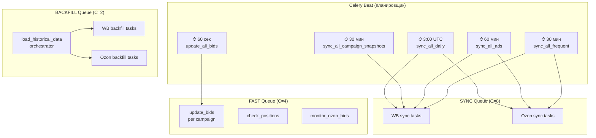
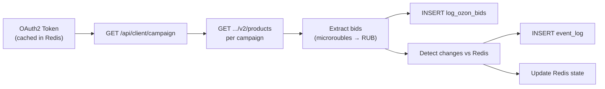
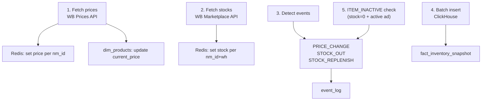
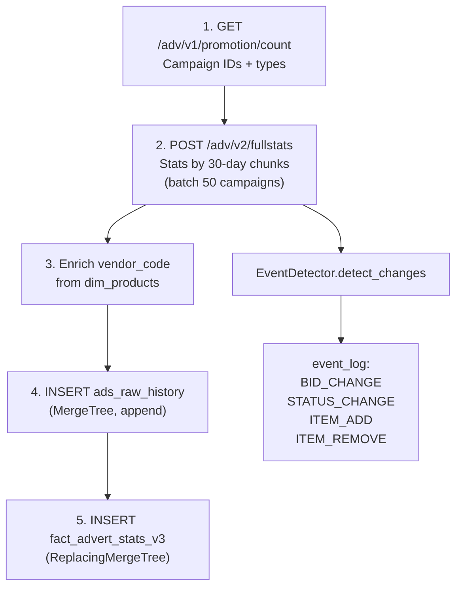
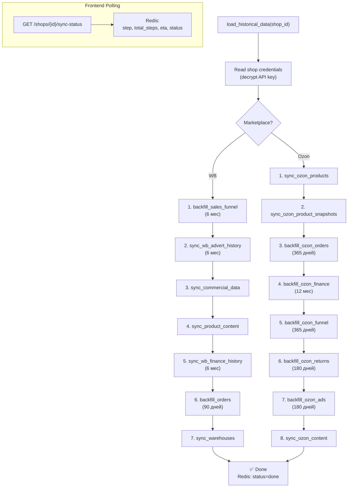

# MP-CONTROL — Celery Pipeline

> Полный разбор всех фоновых задач: очереди, координаторы, data flow, backfill стратегии.  
> Файл-источник: `backend/celery_app/tasks/tasks.py` (4134 строки, 106 функций)

---

## Архитектура задач



---

## Дедупликация задач

Все задачи защищены от дублирования через Redis NX-ключи:

```python
# Перед отправкой:
key = f"task_lock:{task_name}:{shop_id}"
SET key 1 NX EX 1800  # Только если не существует, TTL 30 мин

# После завершения (signal task_postrun):
DEL key
```

Если ключ уже существует → задача уже в очереди или выполняется → пропуск.

---

## Координаторы (dispatchers)

### `sync_all_daily` — ежедневно в 3:00 UTC

Читает все активные магазины → dispatch задач по marketplace:

| Marketplace | Dispatch задачи                                                                                                                                                                                      |
| ----------- | ---------------------------------------------------------------------------------------------------------------------------------------------------------------------------------------------------- |
| **Ozon**    | sync_ozon_products, sync_ozon_product_snapshots, sync_ozon_finance, sync_ozon_funnel, sync_ozon_returns, sync_ozon_seller_rating, sync_ozon_content_rating, sync_ozon_content, sync_ozon_commissions |
| **WB**      | sync_warehouses, sync_product_content                                                                                                                                                                |

### `sync_all_frequent` — каждые 30 мин

| Marketplace | Dispatch задачи                                                                     |
| ----------- | ----------------------------------------------------------------------------------- |
| **Ozon**    | sync_ozon_orders, sync_ozon_warehouse_stocks, sync_ozon_prices, sync_ozon_inventory |
| **WB**      | sync_orders, sync_commercial_data, sync_sales_funnel, sync_wb_advert_history        |

### `sync_all_ads` — каждые 60 мин

| Marketplace | Dispatch задачи                                                      |
| ----------- | -------------------------------------------------------------------- |
| **Ozon**    | sync_ozon_ad_stats, monitor_ozon_bids (каждые 15 мин через frequent) |
| **WB**      | sync_wb_advert_history (ads raw history)                             |

### `sync_all_campaign_snapshots` — каждые 30 мин

Только WB: `sync_wb_campaign_snapshot` (dim_advert_campaigns + log_wb_bids).

---

## FAST Queue — задачи реального времени

### `update_all_bids` → `update_bids` (каждые 60 сек)

```
PostgreSQL: autobidder_settings (is_enabled=true)
     → для каждой кампании: update_bids(shop_id, campaign_id)
         → API: ставка → позиция → коррекция → API: новая ставка
```

### `check_all_positions` → `check_positions` (каждые 5 мин)

```
Tracked keywords → WB API: поисковая выдача → ClickHouse: positions
```

### `monitor_ozon_bids` (каждые 15 мин)



---

## WB Tasks — детальный разбор

### `sync_orders` (30 мин)

| Шаг | Действие                                                                                  |
| --- | ----------------------------------------------------------------------------------------- |
| 1   | Определить `dateFrom` = max(date) из ClickHouse `fact_orders_raw` (fallback: 1 час назад) |
| 2   | `GET /api/v1/supplier/orders?dateFrom=...&flag=0` через MarketplaceClient                 |
| 3   | Маппинг → INSERT в `fact_orders_raw` (ReplacingMergeTree по g_number)                     |

### `sync_commercial_data` (30 мин)



**Сервисы:** `wb_prices_service`, `wb_stocks_service`, `CommercialEventDetector`

### `sync_sales_funnel` (30 мин)

| Шаг | Действие                                                                |
| --- | ----------------------------------------------------------------------- |
| 1   | Получить nm_ids из `dim_products`                                       |
| 2   | Fetch history за вчера + сегодня по chunks of 20 nm_ids × 7-day windows |
| 3   | INSERT в `fact_sales_funnel` (append-only)                              |

**Ограничения API:** max 20 nm_ids/запрос, max 7 дней, 3 req/мин.

### `sync_wb_advert_history` (60 мин)



**Сервис:** `EventDetector` (953 строки) — debouncing, V1/V2 API форматы.

### `sync_wb_campaign_snapshot` (30 мин)

```
1. GET /adv/v1/promotion/count → campaign IDs
2. POST /api/advert/v2/adverts (batch 50) → bids, names, placements
3. → dim_advert_campaigns (ReplacingMergeTree)
4. → log_wb_bids (MergeTree, append) — per nm_id bids
5. → EventDetector.detect_changes_v2()
```

### `sync_wb_finance_history` (backfill)

```
Генерирует недельные интервалы за N дней → для каждой недели:
  GET /api/v5/supplier/reportDetailByPeriod → JSON rows
  → wb_finance_loader.py парсинг → fact_finances (ClickHouse)
Per-request timeout: 120 сек. Rate limit: пауза между неделями.
```

### `sync_product_content` (ежедневно)

```
1. Fetch product cards → titles, descriptions, photos, dimensions
2. Load existing hashes from dim_product_content
3. MD5 compare: title_hash, description_hash, photos_hash, main_photo_id
4. Detect: CONTENT_TITLE_CHANGED, CONTENT_DESC_CHANGED, CONTENT_MAIN_PHOTO_CHANGED
5. Upsert hashes → dim_product_content
6. Update dim_products (name, dimensions, price)
7. Update Redis state (image_url, content_hash)
```

---

## Ozon Tasks — детальный разбор

### `sync_ozon_products` (ежедневно)

```
1. POST /v3/product/list → all product_ids (paginated)
2. POST /v3/product/info/list → detailed info (batches of 100)
3. Upsert → dim_ozon_products (PostgreSQL)
4. Detect image hash changes → event_log
```

### `sync_ozon_orders` (30 мин)

```
1. POST /v3/posting/fbs/list (FBS, 14 дней)
2. POST /v2/posting/fbo/list (FBO, 14 дней)
3. Normalize → 1 row per product per posting
4. INSERT → fact_ozon_orders (ClickHouse, ReplacingMergeTree)
```

### `sync_ozon_finance` (ежедневно)

```
1. POST /v3/finance/transaction/list (2-day window)
2. Normalize → category mapping
3. INSERT → fact_ozon_transactions (ClickHouse)
```

### `sync_ozon_ad_stats` (60 мин)

| Параметр             | Значение | Описание                               |
| -------------------- | -------- | -------------------------------------- |
| `time_limit`         | 1800 сек | 30 мин (магазины с 40+ кампаниями)     |
| `soft_time_limit`    | 1740 сек | Мягкий лимит                           |
| `batch_size`         | 5        | Campaign IDs per report (Ozon: max 10) |
| `BATCH_PAUSE`        | 15 сек   | Пауза между успешными batch'ами        |
| `RETRY_MAX_ATTEMPTS` | 3        | Макс. ретраев при 429/ошибке           |
| `RETRY_PAUSE`        | 60 сек   | Пауза перед ретраем                    |
| `POLL_MAX_WAIT`      | 300 сек  | Макс. ожидание готовности отчёта       |
| `POLL_INTERVAL`      | 10 сек   | Интервал поллинга UUID                 |

```
1. OAuth2 token → GET campaigns
2. Order CSV report (batch 5 campaign_ids)
3. Poll UUID → raw httpx (не MarketplaceClient) → Download CSV/ZIP
4. Parse → INSERT → fact_ozon_ad_daily (ReplacingMergeTree)
Retry: 3 attempts, 60 сек пауза
```

> [!NOTE]
> Поллинг отчёта использует `httpx` напрямую (не MarketplaceClient), чтобы избежать rate limiter overhead на лёгкие GET запросы.
> Backfill lock: при работе `backfill_ozon_ads` периодический sync пропускается (Redis key `ozon_ads_backfill:{perf_client_id}`).

### `sync_ozon_content` (ежедневно)

```
1. Fetch products + info
2. Fetch descriptions (sequential, rate limited)
3. MD5 hashes: title, description, images
4. Compare with dim_ozon_product_content
5. Detect: OZON_MAIN_IMAGE_CHANGED, OZON_SEO_CHANGE
```

### Прочие Ozon задачи

| Задача                        | Частота | Что делает                                                    | Куда пишет            |
| ----------------------------- | ------- | ------------------------------------------------------------- | --------------------- |
| `sync_ozon_product_snapshots` | Daily   | 1 API call → promotions, availability, commissions, inventory | 4 CH таблицы          |
| `sync_ozon_funnel`            | Daily   | POST /v1/analytics/data (14 метрик per SKU)                   | CH                    |
| `sync_ozon_returns`           | Daily   | FBO + FBS returns (30 дней)                                   | CH                    |
| `sync_ozon_warehouse_stocks`  | 30 мин  | FBO + FBS stock levels                                        | CH                    |
| `sync_ozon_prices`            | Daily   | Prices + commissions                                          | CH                    |
| `sync_ozon_seller_rating`     | Daily   | Seller rating metrics                                         | CH                    |
| `sync_ozon_inventory`         | 30 мин  | Prices + stocks snapshot                                      | `fact_ozon_inventory` |
| `sync_ozon_commissions`       | Daily   | Commission rates per product                                  | CH                    |
| `sync_ozon_content_rating`    | Daily   | Content quality scores per SKU                                | CH                    |

---

## Orchestrator: `load_historical_data`

Запускается при подключении нового магазина. Выполняет все backfill задачи **последовательно** через `.apply()` (в том же процессе).



### Progress tracking

```python
# Redis key: sync_status:{shop_id}
{
    "status": "loading",     # loading | done | error
    "current_step": 3,
    "total_steps": 7,
    "step_name": "sync_wb_finance_history",
    "eta_seconds": 420,
    "eta_human": "7 мин",
    "started_at": "2026-02-19T03:00:00Z"
}
```

Frontend полит через `GET /api/v1/shops/{id}/sync-status`.

---

## Event Detection

Система детектирует 10+ типов событий:

### Рекламные события (`EventDetector`)

| Тип             | Триггер                                     |
| --------------- | ------------------------------------------- |
| `BID_CHANGE`    | CPM/CPC ставка изменилась (с debouncing)    |
| `STATUS_CHANGE` | Кампания запущена/остановлена (status 9↔11) |
| `ITEM_ADD`      | Товар добавлен в кампанию                   |
| `ITEM_REMOVE`   | Товар удалён из кампании                    |
| `ITEM_INACTIVE` | Товар в кампании, но 0 показов              |

### Коммерческие события (`CommercialEventDetector`)

| Тип               | Триггер                            |
| ----------------- | ---------------------------------- |
| `PRICE_CHANGE`    | convertedPrice изменилась          |
| `STOCK_OUT`       | Остаток стал 0 (был > 0)           |
| `STOCK_REPLENISH` | Остаток стал > 0 (был 0)           |
| `ITEM_INACTIVE`   | stock=0 + товар в активной рекламе |

### Контентные события

| Тип                           | Триггер                               |
| ----------------------------- | ------------------------------------- |
| `CONTENT_TITLE_CHANGED`       | MD5(title) изменился                  |
| `CONTENT_DESC_CHANGED`        | MD5(description) изменился            |
| `CONTENT_MAIN_PHOTO_CHANGED`  | main_photo_id изменился               |
| `CONTENT_PHOTO_ORDER_CHANGED` | MD5(photos_json) изменился            |
| `OZON_MAIN_IMAGE_CHANGED`     | Ozon image URL изменился              |
| `OZON_SEO_CHANGE`             | Ozon title/description hash изменился |

Все события записываются в `event_log` (PostgreSQL) с `old_value`, `new_value`, `event_metadata` (JSONB).

---

## Backfill стратегии

| Задача                    | Глубина  | Стратегия                                                                 | Rate limit                 |
| ------------------------- | -------- | ------------------------------------------------------------------------- | -------------------------- |
| `backfill_sales_funnel`   | 6 мес    | CSV report (async) → fallback: History API weekly                         | 3 req/мин                  |
| `sync_wb_advert_history`  | 6 мес    | 30-day intervals, batch 50 campaigns                                      | 1 req/мин                  |
| `sync_wb_finance_history` | 6 мес    | Weekly intervals, JSON v5 API                                             | 120с timeout/req           |
| `backfill_orders`         | 90 дней  | Pagination 80K rows, flag=0                                               | 1 req/мин                  |
| `backfill_ozon_orders`    | 365 дней | FBO + FBS, posting/list                                                   | standard                   |
| `backfill_ozon_finance`   | 12 мес   | Calendar months (API limit: 1 month/req)                                  | 1.5с between pages         |
| `backfill_ozon_funnel`    | 365 дней | 90-day quarters                                                           | standard                   |
| `backfill_ozon_returns`   | 180 дней | Standard                                                                  | standard                   |
| `backfill_ozon_ads`       | 180 дней | 30-day chunks (newest first), CSV report, early exit after 5 empty chunks | 60с retry, 15с batch pause |

---

## PostgreSQL подключение (Celery)

Все задачи, которым нужен прямой доступ к PostgreSQL (через `psycopg2`), используют
свойство `Settings.psycopg2_conn_params` из `app/config.py`.

Подробнее:

- **Prod:** парсит `POSTGRES_URL` (URL-encoded пароль, SSL=require)
- **Local:** собирает из отдельных `POSTGRES_HOST`, `POSTGRES_PORT`, `POSTGRES_USER`, `POSTGRES_PASSWORD`, `POSTGRES_DB`

> [!WARNING]
> **Не использовать** manual parsing `POSTGRES_URL` в задачах. Всегда `get_settings().psycopg2_conn_params`.

---

## Changelog

### 2026-02-20

- Обновлены параметры `sync_ozon_ad_stats`: time_limit 600→1800, retry 5/300→3/60, batch_size 10→5, добавлен BATCH_PAUSE
- Обновлён `backfill_ozon_ads`: chunk_days 7→30, описание early exit
- Добавлена секция PostgreSQL подключение (psycopg2_conn_params)
