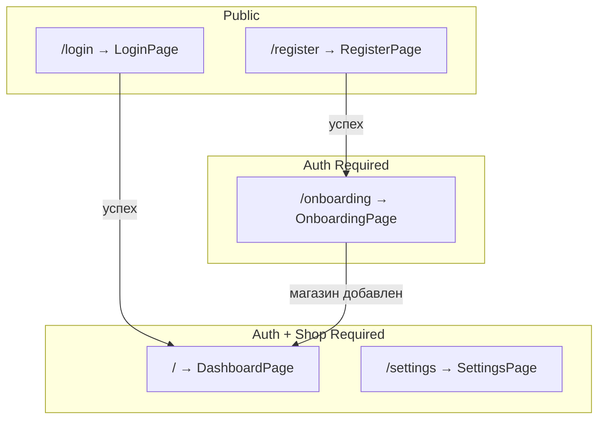
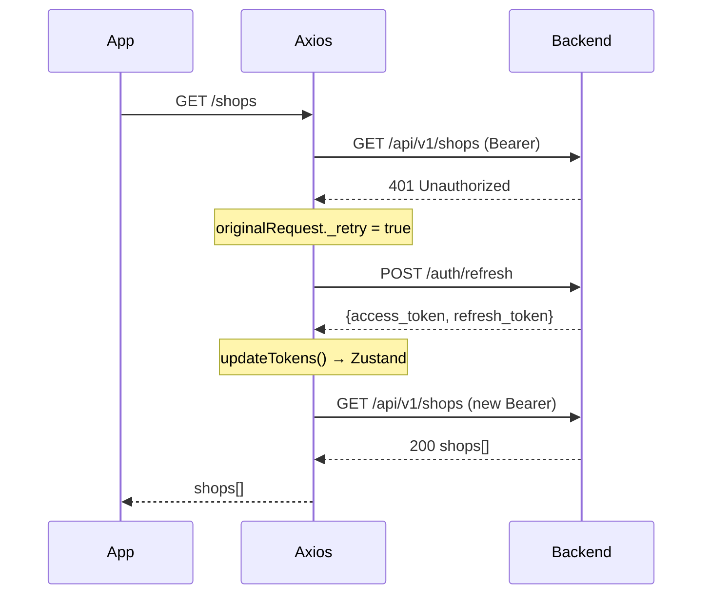

# MP-CONTROL — Frontend

> React 18 + Vite + TypeScript SPA с dark/light темой.  
> Директория: `frontend/src/`

---

## Стек

| Технология    | Назначение                                         |
| ------------- | -------------------------------------------------- |
| React 18      | SPA фреймворк                                      |
| Vite          | Dev server + bundler                               |
| TypeScript    | Типизация                                          |
| Zustand       | State management (persist в localStorage)          |
| Axios         | HTTP client + interceptors                         |
| Framer Motion | Анимации (fade-in, slide-up)                       |
| Lucide React  | Иконки                                             |
| Tailwind CSS  | Утилитарные стили (dark/light через CSS variables) |

---

## Routing



### Guards (HOC)

| Guard             | Файл                             | Логика                                             |
| ----------------- | -------------------------------- | -------------------------------------------------- |
| `AuthGuard`       | `components/auth/AuthGuard.tsx`  | Если `!isAuthenticated` → redirect `/login`        |
| `OnboardingGuard` | `components/OnboardingGuard.tsx` | Если `shops.length === 0` → redirect `/onboarding` |

---

## State Management (Zustand)

### `authStore` — аутентификация

```typescript
interface AuthState {
  user: User | null; // { id, email, name }
  token: string | null; // JWT access token
  refreshToken: string | null; // JWT refresh token
  isAuthenticated: boolean;
  shops: Shop[]; // { id, name, marketplace, isActive, status }

  loginFromApi(data); // Сохранить JWT + user + shops
  logout(); // Очистить всё
  setShops(apiShops); // Обновить список магазинов
  updateTokens(access, refresh); // Обновить токены (после refresh)
}
```

- Persist: `localStorage` → ключ `mp-control-auth`
- `partialize`: сохраняются все поля

### `appStore` — настройки UI

```typescript
interface AppState {
  theme: "dark" | "light"; // Текущая тема
  setTheme(theme); // + toggle CSS class 'light'
  toggleTheme();

  sidebarCollapsed: boolean; // Свёрнут ли sidebar
  toggleSidebar();

  currentShop: AppShop | null; // Выбранный магазин
  setCurrentShop(shop);
}
```

- Persist: `localStorage` → ключ `mp-control-app`
- `onRehydrateStorage`: восстановление CSS class при загрузке

---

## API Layer

### `api/client.ts` — Axios instance

```
Base URL: import.meta.env.VITE_API_URL || '/api/v1'
Timeout: 30 сек
```

**Request interceptor:** автоматически добавляет `Authorization: Bearer {token}` из authStore.

**Response interceptor (401 handling):**



**Queue mechanism:** если refresh уже в процессе → другие 401-запросы ставятся в `failedQueue` → разрешаются после успешного refresh.

### `api/auth.ts` — API функции

```typescript
loginApi(email, password)        → POST /auth/login
registerApi(email, password, name) → POST /auth/register
addShopApi(data)                 → POST /shops
validateKeyApi(data)             → POST /shops/validate-key
getSyncStatusApi(shopId)         → GET /shops/{id}/sync-status
```

---

## Страницы

### `LoginPage` (151 строка)

- Форма: email + password
- API: `loginApi()` → `authStore.loginFromApi()`
- Redirect: `/` (dashboard)
- Ссылка на регистрацию

### `RegisterPage` (156 строк)

- Форма: email + password + name
- API: `registerApi()` → `authStore.loginFromApi()`
- Redirect: `/onboarding`

### `OnboardingPage` (187 строк)

- **ShopWizard** компонент для подключения первого магазина
- Шаги: выбор маркетплейса → ввод ключа → валидация → создание
- По завершении: redirect → `/`

### `DashboardPage` (~1010 строк)

Универсальный дашборд для Ozon и WB. Автоматически определяет маркетплейс по выбранному магазину.

- Ozon → `GET /api/v1/dashboard/ozon?shop_id=X&period=7d`
- WB → `GET /api/v1/dashboard/wb?shop_id=X&period=7d`
- Auto-refresh каждые 2 мин.

**6 KPI-карточек** (Framer Motion анимация, delta к предыдущему периоду):

- Заказы (orders_count)
- Выручка (revenue + avg_check)
- Показы рекламы (views)
- Клики рекламы (clicks)
- Расход рекламы (ad_spend, invertDelta)
- DRR = ad_spend / revenue × 100 (invertDelta)

**Компоненты:**

| Компонент           | Описание                                                                    |
| ------------------- | --------------------------------------------------------------------------- |
| `KpiCard`           | Универсальная карточка: value, delta badge, icon, accent                    |
| `PeriodSelector`    | Сегодня / 7д / 30д                                                          |
| `SalesChart`        | ComposedChart (bar заказы + line выручка, 2 оси Y, Legend)                  |
| `AdsChart`          | ComposedChart рекламной аналитики: 8 метрик, toggle chips, 3 оси Y          |
| `TopProductsTable`  | 3 вкладки: Лидеры / Падающие / Проблемные. Фото 3:4, hover preview, артикул |
| `DashboardSkeleton` | Skeleton loader                                                             |

**Рекламная аналитика (AdsChart) — метрики:**

| Метрика     | Тип      | Ось Y   | Цвет    |
| ----------- | -------- | ------- | ------- |
| Расход ₽    | Area     | left    | #f97316 |
| Показы      | Line     | right   | #3b82f6 |
| Клики       | Line     | right   | #06b6d4 |
| Корзины     | Line     | right   | #8b5cf6 |
| Заказы      | Bar      | left    | #10b981 |
| Общий CTR   | Line (%) | percent | #facc15 |
| ДРР рекламы | Line (%) | percent | #ef4444 |
| Общий ДРР   | Line (%) | percent | #ec4899 |

**Фичи графиков:**

- Оси X: все даты видны (interval=0, angle=-45°), русский формат «21 фев»
- Тултипы: дата «5 февраля (ср.)» — без года, с днём недели
- Легенды: сверху графика, русские имена метрик
- CTR вычисляется на фронте: `clicks / views × 100`

**Hover preview товаров:**

- При наведении на фото → `fixed` overlay 208×160px с крупным изображением
- React state + `getBoundingClientRect()` для позиционирования (обходит overflow-x-auto таблицы)

**API клиент:** `src/api/dashboard.ts` — TypeScript типы + `getOzonDashboardApi()` / `getWbDashboardApi()`.  
**Числа:** полные, без сокращений (например `180 671 ₽`, не `180К ₽`).

**Вспомогательные функции:**

| Функция             | Описание                              |
| ------------------- | ------------------------------------- |
| `formatChartDate`   | ISO → «21 фев» для осей X             |
| `formatTooltipDate` | ISO → «5 февраля (ср.)» для тултипов  |
| `formatDelta`       | Число → «+12.5%» / «-3.2%» с цветом   |
| `formatMoney`       | Число → «180 671 ₽»                   |
| `formatNumber`      | Число → «1 234» (пробелы-разделители) |

### `SettingsPage` (633 строки — самая большая страница)

Управление магазинами:

- Список всех магазинов пользователя (карточки с status badge)
- **ShopWizard** для добавления нового магазина
- **SyncProgressInline** — real-time progress polling (`GET /shops/{id}/sync-status`)
- Редактирование ключей (inline form)
- Удаление магазина (confirmation dialog)
- Marketplace badge (WB/Ozon с разными цветами)
- Status badge: active (зелёный), syncing (синий), auth_error (красный), paused (жёлтый)

---

## Компоненты

| Компонент         | Директория           | Назначение                                   |
| ----------------- | -------------------- | -------------------------------------------- |
| `AppLayout`       | `components/layout/` | Sidebar + Header + content area              |
| `Sidebar`         | `components/layout/` | Навигация (collapse)                         |
| `Header`          | `components/layout/` | Верхняя панель (shop selector, theme toggle) |
| `ShopSelector`    | `components/layout/` | Dropdown выбора магазина                     |
| `AuthGuard`       | `components/auth/`   | Защита маршрутов                             |
| `OnboardingGuard` | `components/`        | Защита от отсутствия магазинов               |
| `ShopWizard`      | `components/shops/`  | Пошаговый мастер подключения                 |
| `Button`          | `components/ui/`     | Единая кнопка (primary/outline/ghost/danger) |
| `Card`            | `components/ui/`     | Карточка с заголовком                        |
| `Skeleton`        | `components/ui/`     | Placeholder для загрузки                     |
| Input/Label       | `components/ui/`     | Элементы форм                                |

---

## Тема (Dark / Light)

```css
/* index.css */
:root {
  --background: 222 47% 6%; /* Dark default */
  --foreground: 210 40% 98%;
  --primary: 263 70% 58%; /* Фиолетовый */
  /* ... */
}
.light {
  --background: 0 0% 100%;
  --foreground: 222 47% 11%;
  /* ... */
}
```

Переключение: `document.documentElement.classList.toggle('light')` через `appStore.toggleTheme()`.

---

## Будущие страницы (зарезервированы в App.tsx)

```typescript
// <Route path="/sales" element={<SalesPage />} />
// <Route path="/funnel" element={<FunnelPage />} />
// <Route path="/warehouses" element={<WarehousesPage />} />
// <Route path="/finances" element={<FinancesPage />} />
// <Route path="/advertising" element={<AdvertisingPage />} />
// <Route path="/events" element={<EventsPage />} />
```

---

### 2026-02-19

- Обновлена секция `DashboardPage`: живые данные из API вместо placeholder, 6 KPI-карточек (Показы/Клики вместо Остатки FBO/Конверсия), компоненты, API клиент

### 2026-02-21

- `DashboardPage` переписан: поддержка Ozon + WB, 1010 строк
- Добавлен `AdsChart` — 8 метрик рекламной аналитики с toggle chips (включая Общий CTR)
- Графики: все даты видны (interval=0, angle=-45°), Legend, русские тултипы «5 февраля (ср.)»
- `TopProductsTable`: фото 3:4 с hover preview (fixed positioning), supplier_article
- Увеличены шрифты: KPI, таблица, артикулы, metric chips (text-[13px]+)
