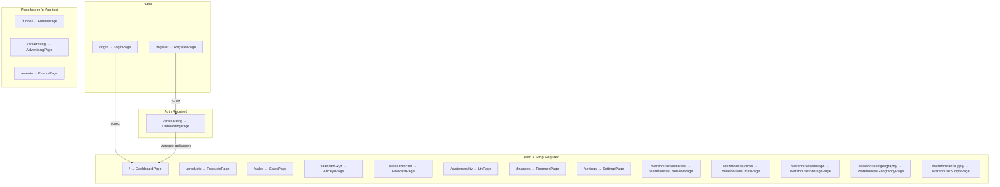
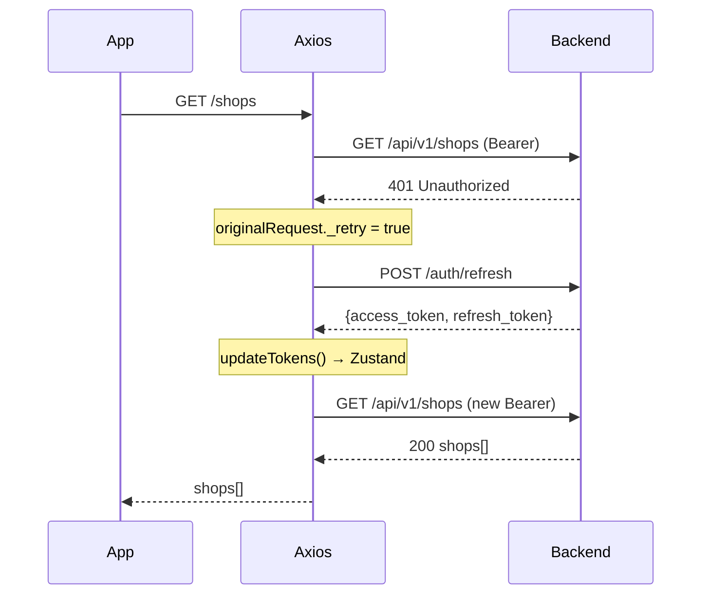

# MP-CONTROL — Frontend

> React 18 + Vite + TypeScript SPA с dark/light темой.  
> Директория: `frontend/src/`

---

## Стек

| Технология    | Назначение                                         |
| ------------- | -------------------------------------------------- |
| React 18      | SPA фреймворк                                      |
| Vite          | Dev server + bundler                               |
| TypeScript    | Типизация                                          |
| Zustand       | State management (persist в localStorage)          |
| Axios         | HTTP client + interceptors                         |
| Framer Motion | Анимации (fade-in, slide-up)                       |
| Lucide React  | Иконки                                             |
| Tailwind CSS  | Утилитарные стили (dark/light через CSS variables) |

---

## Routing


```mermaid
graph TB
    subgraph "Public"
        Login["/login → LoginPage"]
        Register["/register → RegisterPage"]
    end

    subgraph "Auth Required"
        Onboarding["/onboarding → OnboardingPage"]
    end

    subgraph "Auth + Shop Required"
        Dashboard["/ → DashboardPage"]
        Products["/products → ProductsPage"]
        Sales["/sales → SalesPage"]
        AbcXyz["/sales/abc-xyz → AbcXyzPage"]
        Forecast["/sales/forecast → ForecastPage"]
        LTV["/customers/ltv → LtvPage"]
        Finances["/finances → FinancesPage"]
        Settings["/settings → SettingsPage"]
        WhOverview["/warehouses/overview → WarehousesOverviewPage"]
        WhCross["/warehouses/cross → WarehousesCrossPage"]
        WhStorage["/warehouses/storage → WarehousesStoragePage"]
        WhGeo["/warehouses/geography → WarehousesGeographyPage"]
        WhSupply["/warehouses/supply → WarehouseSupplyPage"]
    end

    subgraph "Placeholder (в App.tsx)"
        Funnel["/funnel → FunnelPage"]
        Advertising["/advertising → AdvertisingPage"]
        Events["/events → EventsPage"]
    end

    Login -->|"успех"| Dashboard
    Register -->|"успех"| Onboarding
    Onboarding -->|"магазин добавлен"| Dashboard
```

> [!NOTE]
> `ProductsPage` автоматически выбирает Ozon или WB в зависимости от `currentShop.marketplace`.
> Для WB рендерится компонент `WBProductsPage` (644 строк), для Ozon — `ProductsPage` (820 строк).

### Guards (HOC)

| Guard             | Файл                             | Логика                                             |
| ----------------- | -------------------------------- | -------------------------------------------------- |
| `AuthGuard`       | `components/auth/AuthGuard.tsx`  | Если `!isAuthenticated` → redirect `/login`        |
| `OnboardingGuard` | `components/OnboardingGuard.tsx` | Если `shops.length === 0` → redirect `/onboarding` |

---

## State Management (Zustand)

### `authStore` — аутентификация

```typescript
interface AuthState {
  user: User | null; // { id, email, name }
  token: string | null; // JWT access token
  refreshToken: string | null; // JWT refresh token
  isAuthenticated: boolean;
  shops: Shop[]; // { id, name, marketplace, isActive, status }

  loginFromApi(data); // Сохранить JWT + user + shops
  logout(); // Очистить всё
  setShops(apiShops); // Обновить список магазинов
  updateTokens(access, refresh); // Обновить токены (после refresh)
}
```

- Persist: `localStorage` → ключ `mp-control-auth`
- `partialize`: сохраняются все поля

### `appStore` — настройки UI

```typescript
interface AppState {
  theme: "dark" | "light"; // Текущая тема
  setTheme(theme); // + toggle CSS class 'light'
  toggleTheme();

  sidebarCollapsed: boolean; // Свёрнут ли sidebar
  toggleSidebar();

  currentShop: AppShop | null; // Выбранный магазин
  setCurrentShop(shop);
}
```

- Persist: `localStorage` → ключ `mp-control-app`
- `onRehydrateStorage`: восстановление CSS class при загрузке

---

## API Layer

### `api/client.ts` — Axios instance

```
Base URL: import.meta.env.VITE_API_URL || '/api/v1'
Timeout: 30 сек
```

**Request interceptor:** автоматически добавляет `Authorization: Bearer {token}` из authStore.

**Response interceptor (401 handling):**


```mermaid
sequenceDiagram
    participant App
    participant Axios
    participant Backend

    App->>Axios: GET /shops
    Axios->>Backend: GET /api/v1/shops (Bearer)
    Backend-->>Axios: 401 Unauthorized

    Note over Axios: originalRequest._retry = true
    Axios->>Backend: POST /auth/refresh
    Backend-->>Axios: {access_token, refresh_token}

    Note over Axios: updateTokens() → Zustand
    Axios->>Backend: GET /api/v1/shops (new Bearer)
    Backend-->>Axios: 200 shops[]
    Axios-->>App: shops[]
```

**Queue mechanism:** если refresh уже в процессе → другие 401-запросы ставятся в `failedQueue` → разрешаются после успешного refresh.

### `api/auth.ts` — API функции

```typescript
loginApi(email, password)        → POST /auth/login
registerApi(email, password, name) → POST /auth/register
addShopApi(data)                 → POST /shops
validateKeyApi(data)             → POST /shops/validate-key
getSyncStatusApi(shopId)         → GET /shops/{id}/sync-status
```

---

## Страницы

### `LoginPage` (151 строка)

- Форма: email + password
- API: `loginApi()` → `authStore.loginFromApi()`
- Redirect: `/` (dashboard)
- Ссылка на регистрацию

### `RegisterPage` (156 строк)

- Форма: email + password + name
- API: `registerApi()` → `authStore.loginFromApi()`
- Redirect: `/onboarding`

### `OnboardingPage` (187 строк)

- **ShopWizard** компонент для подключения первого магазина
- Шаги: выбор маркетплейса → ввод ключа → валидация → создание
- По завершении: redirect → `/`

### `DashboardPage` (~1010 строк)

Универсальный дашборд для Ozon и WB. Автоматически определяет маркетплейс по выбранному магазину.

- Ozon → `GET /api/v1/dashboard/ozon?shop_id=X&period=today`
- WB → `GET /api/v1/dashboard/wb?shop_id=X&period=today`
- Auto-refresh каждые 2 мин.
- **Период по умолчанию:** `today` (ранее: `7d`)

**6 KPI-карточек** (Framer Motion анимация, delta к предыдущему периоду):

- Заказы (orders_count)
- Продажи (revenue + avg_check) — сумма заказов × цена, не выручка после возвратов
- Показы рекламы (views)
- Клики рекламы (clicks)
- Расход рекламы (ad_spend, invertDelta)
- DRR = ad_spend / revenue × 100 (invertDelta)

**Компоненты:**

| Компонент           | Описание                                                                             |
| ------------------- | ------------------------------------------------------------------------------------ |
| `KpiCard`           | Универсальная карточка: value, delta badge, icon, accent                             |
| `PeriodSelector`    | Сегодня / 7д / 30д + календарь произвольного диапазона (2 месяца, `popupAlign` проп) |
| `SalesChart`        | ComposedChart (bar заказы + line выручка, 2 оси Y, Legend)                           |
| `AdsChart`          | ComposedChart рекламной аналитики: 8 метрик, toggle chips, 3 оси Y                   |
| `TopProductsTable`  | 3 вкладки: Лидеры / Падающие / Проблемные. Фото 3:4, hover preview, артикул          |
| `DashboardSkeleton` | Skeleton loader                                                                      |

**Рекламная аналитика (AdsChart) — метрики:**

| Метрика     | Тип      | Ось Y   | Цвет    |
| ----------- | -------- | ------- | ------- |
| Расход ₽    | Area     | left    | #f97316 |
| Показы      | Line     | right   | #3b82f6 |
| Клики       | Line     | right   | #06b6d4 |
| Корзины     | Line     | right   | #8b5cf6 |
| Заказы      | Bar      | left    | #10b981 |
| Общий CTR   | Line (%) | percent | #facc15 |
| ДРР рекламы | Line (%) | percent | #ef4444 |
| Общий ДРР   | Line (%) | percent | #ec4899 |

**Фичи графиков:**

- Оси X: все даты видны (interval=0, angle=-45°), русский формат «21 фев»
- Тултипы: дата «5 февраля (ср.)» — без года, с днём недели
- Легенды: сверху графика, русские имена метрик
- CTR вычисляется на фронте: `clicks / views × 100`

**Hover preview товаров:**

- При наведении на фото → `fixed` overlay 208×160px с крупным изображением
- React state + `getBoundingClientRect()` для позиционирования (обходит overflow-x-auto таблицы)

**API клиент:** `src/api/dashboard.ts` — TypeScript типы + `getOzonDashboardApi()` / `getWbDashboardApi()`.  
**Числа:** полные, без сокращений (например `180 671 ₽`, не `180К ₽`).

**Вспомогательные функции:**

| Функция             | Описание                              |
| ------------------- | ------------------------------------- |
| `formatChartDate`   | ISO → «21 фев» для осей X             |
| `formatTooltipDate` | ISO → «5 февраля (ср.)» для тултипов  |
| `formatDelta`       | Число → «+12.5%» / «-3.2%» с цветом   |
| `formatMoney`       | Число → «180 671 ₽»                   |
| `formatNumber`      | Число → «1 234» (пробелы-разделители) |

### `ProductsPage` (~820 строк)

Страница «Ваши товары» для Ozon. Таблица с infinite scroll и серверной сортировкой/фильтрацией.

**Столбцы таблицы:**

| Столбец        | Описание                                                               |
| -------------- | ---------------------------------------------------------------------- |
| Товар          | Фото + название + артикул + SKU + content rating                       |
| Цена           | marketing_price (Ozon) или price, перечёркнутая old_price, % скидки    |
| Остатки        | FBO + FBS (одно число + тултип)                                        |
| Продажи        | price×qty (как в ЛК) + дельта, кол-во шт                               |
| Выплата        | Сумма выплат за период (payout_period)                                 |
| Ср. выпл.      | Средняя выплата за 1 единицу (payout / qty_delivered)                  |
| С/с            | Себестоимость + `margin_percent` = cost/price×100 (доля С/с в цене)    |
| Реклама        | Расход + DRR (ad_spend / sales_amount × 100)                           |
| Услуги МП      | revenue − txn_payout, hover-тултип: скидки+комиссия / логистика+прочее |
| Чистая прибыль | revenue − COGS − mp_fees − ads (Ozon), payout − COGS − ads (WB)        |

**Infinite Scroll:**

- `useRef(page)` и `useRef(loadingMore)` для предотвращения race condition
- Дедупликация при append по `offer_id`
- Строка Σ (итого) использует серверные `apiTotals` — не зависит от подгруженных страниц

**Управление себестоимостью:**

- Inline popover для редактирования (С/с + упаковка)
- Excel bulk upload (.xlsx)
- Excel шаблон для заполнения

### `SalesPage` (~1019 строк)

Страница «Обзор продаж». Универсальная для Ozon и WB, авто-определение маркетплейса.

- Ozon → `GET /api/v1/sales/ozon?shop_id=X&period=7`
- WB → `GET /api/v1/sales/wb?shop_id=X&period=7`
- Auto-refresh каждые 2 мин.

**7 KPI-карточек** (Framer Motion, delta к предыдущему периоду):

- Заказы, Продажи, Возвраты, Показы, Клики, Расход рекламы, DRR

**Компоненты:**

| Компонент          | Описание                                                                        |
| ------------------ | ------------------------------------------------------------------------------- |
| `KpiCard`          | Универсальная карточка: value, delta badge, icon, accent, subtitle              |
| `SalesChart`       | ComposedChart (bar заказы + line выручка + line возвраты + per-product overlay) |
| `TopProductsTable` | Таблица ТОП товаров — unified style (см. ниже)                                  |
| `GeoSection`       | География заказов: города с bar-прогрессом, collapse/expand                     |
| `ReturnReasons`    | Причины возвратов c inline bars                                                 |
| `SalesSkeleton`    | Skeleton loader                                                                 |

**Per-product overlay:** выбор товаров чекбоксами в таблице → их выручка накладывается на общий график (до 10 цветов). Данные запрашиваются через `/sales/ozon/product-daily` или `/sales/wb/product-daily`.

**Таблица ТОП товаров — столбцы:**

- Продажи: Заказы, Продажи, Цена, Возвраты, % возвр. (каждый с delta)
- Рекл. воронка (если есть данные): Показы, Клики, Корзины, CTR, CR→корз, CR→заказ

### `WBProductsPage` (644 строки)

Каталог товаров WB с аналитикой. Аналог `ProductsPage` для Ozon, но с WB-спецификой.

- API: `GET /api/v1/products/wb?shop_id=X&period=7d`
- Себестоимость: `PATCH /api/v1/products/wb/cost`, Excel bulk upload

**Столбцы таблицы:**

| Столбец   | Описание                                             |
| --------- | ---------------------------------------------------- |
| Товар     | CDN-фото + название + артикул                        |
| Заказы    | Кол-во + выручка + дельта                            |
| Остатки   | FBO/FBS (одно число)                                 |
| Цена      | Текущая цена                                         |
| С/с       | Себестоимость + inline редактирование (`WBCostEdit`) |
| Реклама   | Расход + DRR                                         |
| Услуги МП | Удержания маркетплейса                               |
| Прибыль   | Чистая прибыль + маржа                               |

**Компоненты:**

| Компонент    | Описание                                                            |
| ------------ | ------------------------------------------------------------------- |
| `WBCostEdit` | Inline popover для редактирования С/с + упаковки (с подтверждением) |
| `SortTh`     | Кликабельный заголовок с иконкой сортировки                         |
| `DeltaBadge` | Бейдж дельты: зелёный ▲ / красный ▼                                 |

**Фичи:**

- Серверная сортировка по 8 полям
- Фильтры: Все / С рекламой / Без рекламы / Лидеры / Падающие / Нет остатков
- WB CDN: `wbImageUrl(nmId)` — динамическая генерация URL фото
- Excel bulk upload себестоимости (колонка A = артикул, B = С/с)
- Поиск по артикулу/названию

### `ForecastPage` (387 строк)

Страница «Прогноз продаж». Универсальная для Ozon и WB.

- Ozon → `GET /api/v1/sales/ozon/forecast?shop_id=X&period=90`
- WB → `GET /api/v1/sales/wb/forecast?shop_id=X&period=90`

**Секции:**

1. **Общий прогноз** — ComposedChart с областью (actual + forecast) + доверительный интервал
2. **KPI-карточки** — 5 метрик: прогноз выручки, прогноз заказов, средний чек, тренд, точность модели
3. **SKU-анализ** — карточки «Сейчас → Будет → Делай» по каждому товару

**Компоненты:**

| Компонент         | Описание                                                                                                |
| ----------------- | ------------------------------------------------------------------------------------------------------- |
| `KpiCard`         | Локальная карточка KPI с trend-стрелкой                                                                 |
| `SkuAnalysisCard` | Карточка товара: severity (critical/warning/opportunity/ok), текущие и прогнозные метрики, рекомендации |
| `MetricRow`       | Строка метрики (label + value + color)                                                                  |

**Severity уровни:**

| Уровень        | Цвет      | Описание    |
| -------------- | --------- | ----------- |
| 🔴 critical    | red-500   | Критично    |
| 🟡 warning     | amber-500 | Внимание    |
| 🟢 opportunity | emerald   | Возможность |
| ✅ ok          | border    | Ок          |

### `AbcXyzPage` (~510 строк)

Страница «ABC/XYZ Анализ». Классификация товаров по вкладу в выручку и стабильности спроса.

- Ozon → `GET /api/v1/sales/ozon/abc-xyz?shop_id=X&period=90`
- WB → `GET /api/v1/sales/wb/abc-xyz?shop_id=X&period=90`
- Excel → `GET /api/v1/sales/{mp}/abc-xyz/xlsx` (blob download)

**Компоненты:**

| Компонент       | Описание                                                         |
| --------------- | ---------------------------------------------------------------- |
| ABC сводка      | 3 карточки (A/B/C): кол-во товаров, % выручки, градиентные цвета |
| XYZ сводка      | 3 карточки (X/Y/Z): стабильность спроса, CV пороги               |
| Матрица 3×3     | Интерактивная сетка: AX..CZ с emoji, градиентами, клик фильтрует |
| `ProductsTable` | Таблица товаров с сортировкой, sticky-колонкой, фото товара      |

**Тогглы периода:** 30 дн. / 60 дн. / 90 дн.  
**Тоггл ABC по:** Выручка / Чистая прибыль  
**Excel экспорт:** Кнопка «📥 Excel» — скачивание .xlsx через `downloadAbcXyzXlsx()` (blob, RFC 5987 filename)

### `LtvPage` (~830 строк)

Страница «Клиентская аналитика (LTV)». Универсальная для Ozon и WB.

- Ozon → `GET /api/v1/sales/ozon/ltv` + `/chain` + `/xlsx`
- WB → `GET /api/v1/sales/wb/ltv` + `/chain` + `/xlsx`

**4 KPI-карточки:**

- Покупатели (total_clients)
- Повторные (repeat_clients, repeat_rate %)
- Ср. LTV (avg_ltv)
- Ср. чек (avg_check)

**Секции:**

| Секция                       | Описание                                                          |
| ---------------------------- | ----------------------------------------------------------------- |
| Новые / повторные покупатели | Stacked bar chart по месяцам (recharts), тултип с выручкой        |
| Когортная матрица            | Heatmap: % удержания клиентов по месяцам (зелёный/жёлтый/красный) |
| Товары — повторные покупки   | Таблица SKU: покупатели, повторы, conv_to_2/3, ср. дней, LTV      |
| Дистрибуция времени          | Гистограмма: дни между покупками (0-7, 7-14, ... 90+)             |
| Цепочка покупок L1→L5        | Sankey-карточки: что покупают после целевого товара, конверсии    |

**Фичи:**

- Кнопка «📥 Excel» в шапке — скачивание .xlsx (7 листов) через `downloadLtvXlsx()` / `downloadWbLtvXlsx()`
- Компонент `MonthlyBuyersChart` — stacked bar chart (зелёный = новые, фиолетовый = повторные) с тултипом выручки
- Клик по SKU в таблице → запрос `/chain` и отображение цепочки покупок
- Поиск по артикулу в SKU таблице
- Период: 30д / 90д / 6м / 1г / Всё время
- Фото товаров: CDN-миниатюры с hover-увеличением
- Ozon/WB авто-определение по `currentShop.marketplace`

**API модули:** `src/api/ltv.ts` (Ozon: `fetchLtv`, `fetchPurchaseChain`, `downloadLtvXlsx`), `src/api/wb_ltv.ts` (WB: `fetchWbLtv`, `fetchWbPurchaseChain`, `downloadWbLtvXlsx`)

### `FinancesPage` (~1009 строк)

Страница «Финансы». Полный P&L анализ для Ozon и WB.

- Ozon → `GET /api/v1/finances/ozon` + `GET /api/v1/finances/ozon/products`
- WB → `GET /api/v1/finances/wb` + `GET /api/v1/finances/wb/products`

**6 KPI-карточек:**

- Выручка, К перечислению, Расходы МП (% от перечисления), Реклама (ДРР), Себестоимость (% от выручки), Чистая прибыль (% от выручки)

**Секции:**

| Секция              | Компонент             | Описание                                                                                                     |
| ------------------- | --------------------- | ------------------------------------------------------------------------------------------------------------ |
| Структура расходов  | `BreakdownChart`      | Waterfall: revenue → commission → payout → expenses → profit                                                 |
| Детализация товаров | `ProductFinanceTable` | P&L по каждому товару — unified table style (см. ниже)                                                       |
| Динамика            | `DynamicsChart`       | ComposedChart: 8 метрик с toggle chips (revenue, profit, payout, operating, mp_fees, ad_spend, cogs, orders) |
| Сравнение периодов  | `ComparisonTable`     | Текущий vs предыдущий период: 15 показателей с Δ                                                             |

**GroupBySelector:** день / неделя / месяц

**Waterfall (BreakdownChart):**

- Подытог «= К перечислению» (после комиссии), «= Прибыль» (финал)
- Нулевые строки скрыты автоматически
- Разделительные линии перед подытогами

### `SettingsPage` (633 строки)

Управление магазинами:

- Список всех магазинов пользователя (карточки с status badge)
- **ShopWizard** для добавления нового магазина
- **SyncProgressInline** — real-time progress polling (`GET /shops/{id}/sync-status`)
- Редактирование ключей (inline form)
- Удаление магазина (confirmation dialog)
- Marketplace badge (WB/Ozon с разными цветами)
- Status badge: active (зелёный), syncing (синий), auth_error (красный), paused (жёлтый)

### `WarehousesOverviewPage` (~1130 строк)

Страница «Обзор складов» — единый дашборд аналитики по складам WB. Диагностика проблем, расходы, таблица складов.

- API: `GET /api/v1/warehouses/wb/analytics?shop_id=X`
- Только WB (Ozon — другая страница аналитики)

**4 KPI-карточки** (Framer Motion анимация, тренды):

| KPI | Описание |
| --- | --- |
| Оборачиваемость | Средневзвешенная оборачиваемость по складам (дни) |
| Заказы / день | Средние дневные продажи |
| Остатки | Суммарные остатки на всех складах |
| SKU на складах | Общее количество уникальных артикулов |

**Блок «Диагностика проблем»** — автоматический анализ:

| Карточка | Severity | Условие |
| --- | --- | --- |
| Высокий кросс | warning/critical | Склады с кросс% > 40% |
| Дорогое хранение | warning | storage_cost > порог |
| Скоро out-of-stock | critical | SKU с запасом < 7 дней на ВСЕХ складах |
| Штрафы | info | Штрафы за период > 0 |

> Блок «Нужна поставка» удалён (2026-03-16) — дублировал «Скоро out-of-stock» и страницу «Поставки».

**Блок «Расходы за период»** — горизонтальные бары:

- Логистика (+ ↳ Кросс как подстрока, `logistics_cost × cross_orders / orders`)
- Хранение, Возмещение, Списание за отзыв, Приёмка, Удержания

**Таблица «Склады»** — 20+ складов с сортировкой:

| Столбец | Описание |
| --- | --- |
| Склад | Название + регион (кластер) + фуд-иконка |
| Статус | Бейдж: Норма / Критич. / Перезат. / Пусто |
| Остаток | Суммарный сток |
| Заказов | За период |
| В день | Среднедневные продажи |
| Оборач. | Дни оборачиваемости (цвет: 🟢<60, 🟡<120, 🔴>120) |
| Кросс% | Доля кросс-заказов (цвет: 🟢<30%, 🟡<50%, 🔴>50%) |
| Хранение ₽ | Расход хранения |
| SKU | Количество артикулов |

**Компоненты:**

| Компонент | Описание |
| --- | --- |
| `ProblemCard` | Карточка проблемы: severity badge, icon, title, details, link |
| `KpiCard` | Анимированная KPI: value, trend, subtitle |
| `ProductCell` | Фото + название + артикул товара (combobox-select в SKU фильтрах) |

**Excel экспорт остатков:**

- Кнопка «📥 Excel» в header таблицы складов (WarehousesTable / OzonWarehousesTable)
- WB → `GET /api/v1/warehouses/wb/analytics/stock-report/excel` (blob download)
- Ozon → `GET /api/v1/warehouses/ozon/overview/stock-report/excel` (blob download)
- API функция: `downloadStockReportExcel(shopId, period, marketplace)` в `api/warehouses.ts`
| `AIDiagnosticsBlock` | ИИ-анализ (Gemini): проблемные SKU, перераспределение, советы |

---

### `WarehousesCrossPage` (~980 строк)

Страница «Кросс-логистика» — анализ кросс-отправок, потерь и рекомендаций по оптимизации размещения товаров.

- API: `GET /api/v1/warehouses/wb/analytics?shop_id=X`
- Период: 7 / 14 / 30 / 60 / 90 дн (дефолт: 30)
- Только WB

**4 KPI-карточки:**

| KPI | Описание |
| --- | --- |
| Кросс-логистика | `≈ Σ(wh.logistics_cost × wh.cross_orders / wh.orders)` — оценочная стоимость кросс-доставки |
| Средний кросс% | Средний % кросс-заказов по всем складам |
| Проблемных SKU | SKU с кросс% > 40% и ≥5 заказов |
| Склады с кроссом | Количество складов с высоким кросс% |

> **Расчёт кросс-стоимости:** WB не разделяет логистику на кросс/обычную в отчётах. Стоимость рассчитывается пропорционально: для каждого склада `logistics_cost × (cross_orders / total_orders)`. Пометка `≈` указывает на оценочный характер. Идентична цифре на WarehousesOverviewPage.

**Секции:**

| Секция | Компонент | Описание |
| --- | --- | --- |
| Топ-проблемные SKU | `TopProblemSkus` | Таблица SKU: склад, заказов, кросс%, потери (≈), куда довезти |
| Кросс-карта | `CrossWarehouseMatrix` | Матрица «склад × округ» — откуда/куда, зелёный=свой, красный=кросс |
| Кросс-анализ по складам | `CrossWarehousesTable` | Раскрываемые строки: склад → SKU детализация |
| ИИ-рекомендации | `AICrossRecommendations` | Gemini анализ с действиями |

**Компонент `SkuGeographyPanel`** — при клике на SKU:

- Где лежит (stock по складам) и куда продаётся (заказы по округам)
- Рекомендации: «Перераспределить на склад X» / «Поставить ещё на склад Y»

---

### `WarehouseSupplyPage` (~1250 строк)

Страница «Поставки». **Единый интерфейс** — автоматически переключается по `currentShop.marketplace`:

- **Ozon**: `SupplyTable` + `HubTable` (поставки FBO по кластерам)
- **WB**: `WBSupplyTable` + `WBWarehouseSummaryTable` (поставки по складам с учётом хранения)

#### Ozon-ветка

- API: `GET /api/v1/warehouses/ozon/supply`
- Export: `GET /api/v1/warehouses/ozon/supply/xlsx`

**5 KPI-карточек:**

- Всего SKU, К поставке (ед.), Критичных, Требует внимания, Дн. запаса (ср.)

**Настройки:**

| Параметр           | UI                  | Default |
| ------------------ | ------------------- | ------- |
| Период продаж      | Ползунок 7-90 дн.   | 30      |
| Целевой запас      | Ползунок 14-120 дн. | 60      |
| Коэф. безопасности | Ползунок 1.0-2.0    | 1.15    |
| Учитывать рекламу  | Чекбокс             | ✅      |

**Табы (Ozon):**

| Таб          | Компонент     | Описание                                   |
| ------------ | ------------- | ------------------------------------------ |
| По SKU       | `SupplyTable` | Группировка по SKU → кластеры (expandable) |
| По кластерам | `HubTable`    | Группировка по складу отгрузки → SKU       |

#### WB-ветка

- API: `GET /api/v1/warehouses/wb/supply`
- Export: `GET /api/v1/warehouses/wb/supply/xlsx`

**4 KPI-карточки:**

- Итого поставить, Критические SKU (<14 дн), Перезатарка (>target_days), Хранение/мес (₽)

**Настройки (`WBSettingsPanel`):**

| Параметр          | UI                     | Default |
| ----------------- | ---------------------- | ------- |
| Горизонт поставки | 14 / 30 / 45 / 60 дней | 45      |
| Период продаж     | 14 / 30 / 60 / 90 дней | 30      |
| Страховой буфер   | 0-30%                  | 15%     |

> ⚠ «WB: хранение платное с 1-го дня, коэфф. фиксируется на 60 дн»

**Табы (WB):**

| Таб        | Компонент                 | Описание                                          |
| ---------- | ------------------------- | ------------------------------------------------- |
| По товарам | `WBSupplyTable`           | SKU → expand → детализация по складам             |
| По складам | `WBWarehouseSummaryTable` | Сводка: товаров, остатки, заказы, коэфф., приёмка |

**WB-компоненты (inline):**

| Компонент                 | Описание                                           |
| ------------------------- | -------------------------------------------------- |
| `WBContent`               | Автономный: state, fetch, KPIs, tabs, settings     |
| `WBSupplyTable`           | Expandable таблица SKU с сортировкой по 5 ключам   |
| `WBWarehouseDetailTable`  | Expand-row: склад, остаток, заказы, оборач., хран. |
| `WBWarehouseSummaryTable` | Сводка по складам WB с коэфф. хранения и приёмки   |
| `WBSettingsPanel`         | Горизонт, период, буфер (без Ad Boost)             |
| `WBStatusBadge`           | 4 статуса: критично/внимание/норма/перезатарка     |

**API модуль:** `src/api/warehouses.ts`:

- Ozon: `SupplyItem`, `SupplyCluster` (`wh_stock`, `warehouses[]`), `HubSummary`, `HubItem` (`wh_stock`), `SupplyResponse`
- WB: `WBSupplyItem`, `WBWarehouseDetail`, `WBWarehouseSummary`, `WBSupplyResponse`

**Ozon кластерная таблица (`ClusterTable`):** колонка «Сток РФЦ» показывает реальные остатки на складах, обслуживающих кластер (ранее «Оц. стока» — пропорциональная оценка).

---

## Компоненты

| Компонент             | Директория           | Назначение                                               |
| --------------------- | -------------------- | -------------------------------------------------------- |
| `AppLayout`           | `components/layout/` | Sidebar + Header + content area                          |
| `Sidebar`             | `components/layout/` | Навигация (collapse, nested menu)                        |
| `Header`              | `components/layout/` | Верхняя панель (shop selector, theme toggle)             |
| `ShopSelector`        | `components/layout/` | Dropdown выбора магазина                                 |
| `AuthGuard`           | `components/auth/`   | Защита маршрутов                                         |
| `OnboardingGuard`     | `components/`        | Защита от отсутствия магазинов                           |
| `ShopWizard`          | `components/shops/`  | Пошаговый мастер подключения                             |
| `ProductFinanceTable`   | `components/`        | Товарный P&L — unified table style                       |
| `CampaignUnifiedModal`  | `components/`        | Единый модал кампании: управление + аналитика (табы)     |
| `CampaignManagementModal` | `components/`      | Управление кампанией: кластеры, товары, ставки           |
| `CampaignDetailModal`   | `components/`        | Аналитика кампании: графики, KPI, фразы, ИИ-анализ      |
| `DateRangePicker`       | `components/`        | Календарь произвольного диапазона (2 месяца, popupAlign) |
| `Button`                | `components/ui/`     | Единая кнопка (primary/outline/ghost/danger)             |
| `Card`                  | `components/ui/`     | Карточка с заголовком                                    |
| `Badge`                 | `components/ui/`     | Стилизованный бейдж                                      |
| `Skeleton`              | `components/ui/`     | Placeholder для загрузки                                 |
| Input/Label             | `components/ui/`     | Элементы форм                                            |

---

## Sidebar навигация

Bоковая панель с вложенной навигацией (collapse + expand):

| Секция         | Пункт            | Путь                       | Иконка          | Статус         |
| -------------- | ---------------- | -------------------------- | --------------- | -------------- |
| **АНАЛИТИКА**  | Обзор            | `/`                        | LayoutDashboard | ✅ Активен     |
|                | Товары           | `/products`                | Package         | ✅ Активен     |
|                | Продажи ▾        |                            | ShoppingCart    | ✅ Группа      |
|                | └ Обзор продаж   | `/sales`                   | TrendingUp      | ✅ Активен     |
|                | └ ABC/XYZ анализ | `/sales/abc-xyz`           | Grid3X3         | ✅ Активен     |
|                | └ Прогноз        | `/sales/forecast`          | LineChart       | ✅ Активен     |
|                | Реклама ▾        |                            | Megaphone       | ✅ Группа      |
|                | └ Обзор          | `/advertising/analytics`   | BarChart3       | ✅ Активен     |
|                | └ Кампании       | `/advertising/campaigns`   | List            | ✅ Активен     |
|                | Воронка          | `/funnel`                  | BarChart3       | 🚧 Placeholder |
|                | Склады ▾         |                            | Warehouse       | ✅ Группа      |
|                | └ Обзор          | `/warehouses/overview`     | BarChart3       | ✅ Активен     |
|                | └ Кросс-логистика| `/warehouses/cross`        | ArrowLeftRight  | ✅ Активен     |
|                | └ Хранение       | `/warehouses/storage`      | Archive         | ✅ Активен     |
|                | └ География      | `/warehouses/geography`    | MapPin          | ✅ Активен     |
|                | └ Поставки       | `/warehouses/supply`       | TrendingUp      | ✅ Активен     |
|                | Финансы          | `/finances`                | DollarSign      | ✅ Активен     |
| **УПРАВЛЕНИЕ** | Реклама ▾        |                            | Megaphone       | ✅ Группа      |
|                | └ Управление     | `/advertising/campaigns`   | Settings2       | ✅ Активен     |
|                | └ Автобиддер     | `/advertising/autobidder`  | Bot             | ✅ Активен     |
|                | События ▾        |                            | Activity        | ✅ Группа      |
|                | └ Лента          | `/events`                  | Activity        | ✅ Активен     |
|                | └ Анализ         | `/events/analysis`         | Globe           | ✅ Активен     |
| **КЛИЕНТЫ**    | LTV              | `/customers/ltv`           | Users           | ✅ Активен     |
| **СИСТЕМА**    | Настройки        | `/settings`                | Settings        | ✅ Активен     |

---

## Unified Table Design

Таблицы `TopProductsTable` (SalesPage), `ProductFinanceTable` (FinancesPage) и `ProductsTable` (AbcXyzPage) приведены к единому стилю:

| Свойство           | Реализация                                                          |
| ------------------ | ------------------------------------------------------------------- |
| Контейнер          | `rounded-2xl border bg-[hsl(var(--card))]` с overflow-hidden        |
| Title bar          | Заголовок + описание/счётчик товаров                                |
| Высота             | `max-h-[600px]` — вертикальный скролл внутри                        |
| Sticky header      | `thead.sticky.top-0.z-20` — заголовки всегда видны                  |
| Sticky 1-й столбец | `position: sticky; left: 0; box-shadow: 2px 0 8px…`                 |
| Sticky footer      | `tfoot.sticky.bottom-0.z-20` — строка «Итого» (ProductFinanceTable) |
| Zebra striping     | Чередование строк: `bg-card` / `bg-muted/0.06`                      |
| Ячейки             | Padding: `px-4 py-3.5` (header), `px-4 py-3` (body)                 |
| Шрифты             | `text-[13px] font-semibold` (header), `text-[13px]` (body)          |

---

## Тема (Dark / Light)

```css
/* index.css */
:root {
  --background: 222 47% 6%; /* Dark default */
  --foreground: 210 40% 98%;
  --primary: 263 70% 58%; /* Фиолетовый */
  /* ... */
}
.light {
  --background: 0 0% 100%;
  --foreground: 222 47% 11%;
  /* ... */
}
```

Переключение: `document.documentElement.classList.toggle('light')` через `appStore.toggleTheme()`.

---

## Placeholder-страницы (активны в App.tsx)

Следующие маршруты зарегистрированы в `App.tsx` и отображаются в Sidebar, но содержат placeholder-компоненты:

```typescript
<Route path="/funnel" element={<FunnelPage />} />
<Route path="/advertising" element={<AdvertisingPage />} />
<Route path="/events" element={<EventsPage />} />
```

---

### 2026-02-19

- Обновлена секция `DashboardPage`: живые данные из API вместо placeholder, 6 KPI-карточек (Показы/Клики вместо Остатки FBO/Конверсия), компоненты, API клиент

### 2026-02-21

- `DashboardPage` переписан: поддержка Ozon + WB, 1010 строк
- Добавлен `AdsChart` — 8 метрик рекламной аналитики с toggle chips (включая Общий CTR)
- Графики: все даты видны (interval=0, angle=-45°), Legend, русские тултипы «5 февраля (ср.)»
- `TopProductsTable`: фото 3:4 с hover preview (fixed positioning), supplier_article
- Увеличены шрифты: KPI, таблица, артикулы, metric chips (text-[13px]+)

### 2026-02-22

- Добавлена секция `ProductsPage` — страница товаров Ozon с infinite scroll, себестоимостью, Excel загрузкой
- Порядок столбцов: Товар → Цена → Остатки → Продажи → С/с → Реклама → Возвр. → Чистая прибыль → События
- Infinite scroll: `useRef` для page/loadingMore, дедупликация по offer_id

### 2026-02-24

- Столбец «Услуги МП» с hover-тултипом: детализация скидки+комиссия / логистика+прочее
- Строка Σ (итого) переключена на серверные `apiTotals` — корректные суммы без зависимости от infinite scroll
- Формула прибыли: `txn_payout − COGS − ads` (учтены ВСЕ удержания Ozon)
- Типы `OzonProduct`, `WBProduct`: добавлены `mp_fees_commission`, `mp_fees_logistics`

### 2026-02-25

- **Ozon prибыль**: формула `revenue − COGS − mp_fees − ad_spend` (ранее `txn_payout − COGS − ad`)
- **Ozon totals**: добавлены `payout` (95k вместо 0₽) и `avg_price` (средняя выплата) в строку Σ
- **WB `wbToOzon`**: `margin_percent` = `(cost+packaging) / price × 100` (доля С/с; ранее = profit %)
- **WB `wbToOzon`**: `grossProfitPct` = `profit / sales_amount × 100` (от продаж; ранее / payout)
- **Ozon+WB**: `margin_percent` теперь без знака ±, цвета: зелёный <30%, жёлтый 30-50%, красный >50%
- Тултип С/с: «Себестоимость + упаковка. Процент — доля С/с в цене из ЛК»

### 2026-02-26

- **FinancesPage — UI улучшения читаемости:**
  - **Формат дат:** `formatDateRange()` — русский формат «9 — 15 фев 2026 (7 дней)», `whitespace-nowrap`
  - **Waterfall:** подытог «= К перечислению» после комиссии (голубой, % от выручки)
  - **Waterfall:** строки «Удержания» и «Плат. приёмка» (ранее не отображались)
  - **Waterfall:** знак минус при убытке (`-15 648 ₽` вместо `15 648`)
  - **Waterfall:** нулевые строки (`Штрафы = 0`) скрываются автоматически
  - **Waterfall:** разделительные линии перед подытогом и результатом
  - **KPI:** «Услуги МП» → «Расходы МП» = operating only (без комиссии), % от перечисления
  - **KPI:** «Себестоимость» — добавлен subtitle `% от выручки`

### 2026-02-27

- **FinancesPage (Ozon):** В `ProductFinanceTable` вместо технических идентификаторов (например, 1С кодов для FBS) теперь выводится полное название товара Ozon из базы (`name`). Технический артикул отображается серым цветом под ним.
- **`DateRangePicker.tsx`:** Добавлен проп `popupAlign: 'left' | 'right'` (default `'right'`). Решает проблему обрезки календаря на страницах, где кнопка слева.
- **`DateRangePicker.tsx`:** CSS `.rdp-months`: явный `flex-direction: row; flex-wrap: nowrap` + `minWidth: 580px` — гарантирует 2 месяца рядом (ранее стакались вертикально).
- **`ProductsPage.tsx`:** `PeriodSelector` получает `popupAlign="left"` — календарь открывается вправо от кнопки.

### 2026-02-28

- **`DashboardPage.tsx`:** KPI-карточка «Выручка» переименована в «Продажи» (там отображается сумма заказов, не выручка после возвратов). Переименовано во всех 5 местах: KPI, тултип, легенда, таблица топ-товаров.
- **`DashboardPage.tsx`:** Период по умолчанию изменён с `'7d'` на `'today'`.

### 2026-03-01

- **Добавлена секция `SalesPage`** — Обзор продаж (1019 строк): 7 KPI, география, возвраты, per-product overlay
- **Добавлена секция `AbcXyzPage`** — ABC/XYZ анализ (489 строк): матрица 3×3, таблица товаров
- **Обновлён Routing:** 6 активных роутов (добавлены /sales, /sales/abc-xyz, /finances, /products)
- Добавлен `PeriodSelector` в таблицу компонентов

### 2026-03-02

- **Добавлена секция `ForecastPage`** (387 строк): прогноз продаж Ozon/WB, SKU-анализ, SkuAnalysisCard, severity levels
- **Добавлена секция `WBProductsPage`** (644 строки): каталог товаров WB с аналитикой, WBCostEdit, серверная сортировка, фильтры
- **Добавлена секция `FinancesPage`** (1009 строк): P&L, waterfall BreakdownChart, DynamicsChart (8 метрик), ComparisonTable, GroupBySelector
- **Routing diagram:** обновлена — 7 активных + 4 placeholder маршрута
- **Sidebar навигация:** полная таблица с секциями, вложенным меню «Продажи», статусами страниц
- **Unified Table Design:** документирован единый стиль таблиц (sticky header/column/footer, `max-h-[600px]`, zebra, rounded card)
- **Компоненты:** добавлены `ProductFinanceTable`, `DateRangePicker`, `Badge`
- **Placeholder-страницы:** уточнено описание (активны в App.tsx, а не закомментированы)
- **API Layer:** добавлены `forecast.ts`, `wb-products.ts` — 9 API-модулей вместо 7

### 2026-03-03

- **Добавлена секция `LtvPage`** (~710 строк): клиентская аналитика Ozon/WB — когорты, SKU повторы, цепочка L1→L5
- **Routing diagram:** добавлен `/customers/ltv`
- **Sidebar:** добавлена секция «КЛИЕНТЫ» с пунктом LTV
- **API Layer:** добавлены `ltv.ts`, `wb_ltv.ts` — 11 API-модулей вместо 9

### 2026-03-06

- **`EventsPage`**: добавлены стили для OZON_PRICE_CHANGE ($ amber), OZON_STOCK_OUT (↓ red), OZON_STOCK_REPLENISH (↑ green), OZON_CONTENT_CHANGE (🎨 teal)
- **EVENT_STYLE:** 20+ типов событий (покрытие WB + Ozon полностью)

### 2026-03-07

- **EventCard UX-редизайн:**
  - Шрифты увеличены: название 15px, тип события 15px semibold, detail 14px, артикул 12px bold uppercase
  - Padding карточки 20px, image 64×85, icon badge 28px, accent bar 4px
  - **ValueChange** — новый компонент: зачёркнутое старое → жирное цветное новое + бейдж дельты (↑ зелёный / ↓ красный с %)
  - Контекстные placeholder-иконки: Megaphone (реклама), Palette (контент), DollarSign (коммерция) вместо Package
  - Кампания: отдельный блок с фоном, имя 13px font-semibold, ID в mono-бейдже
  - Иерархия: тип события → значения → товар → артикул → кампания
- **DayGroup:** заголовок 17px, gap между карточками 12px, mb 16px

### 2026-03-09

- **EventsPage — PeriodSelector + календарь:**
  - Интегрирован `PeriodSelector` с поддержкой `date_from`/`date_to` для выбора произвольного диапазона дат
  - Исправлена проблема с UTC-смещением в `fmtDate` (используются локальные компоненты даты)
- **EventsPage — CampaignItemsList:**
  - Новый компонент для структурированного отображения товаров кампании (CAMPAIGN_CREATED/OZON_CAMPAIGN_CREATED)
  - Вертикальный список: артикул (13px mono, primary color) → название → #sku бейдж
  - Expandable: первые 3 товара, кнопка «Ещё N товаров» с русским склонением
  - Zebra-striping, `нет артикула` в muted italic при отсутствии offer_id
- **EventCard иерархия:**
  - Название кампании перемещено на Row 2 — сразу после типа события (ранее — внизу карточки)
  - Иерархия: тип события → кампания → detail/values → товар → товары кампании
- **API тип:** `EventItem.campaign_items?: {offer_id, nm_id, name}[]` — новое поле
- **EventsGraphPage — ИИ-анализ:**
  - Карточка «ИИ-анализ событий» (Gemini 2.5 Flash) с кнопкой «Запустить анализ» / «Перезапустить анализ»
  - SSE streaming через `streamEventsAnalysis()` (api `events_graph.ts`)
  - Markdown рендеринг: жирный, списки, таблицы, emoji-заголовки
  - **Сброс при смене магазина:** `useEffect` по `[shop, period, groupBy]` — abort stream + reset `analysisText`, `analysisError`, `analysisLoading`, `analysisDone`
  - Spinner во время стрима, пульсирующий курсор в конце текста

### 2026-03-09 (Склады)

- **`WarehouseSupplyPage`** (~830 строк): рекомендации по поставке FBO, 5 KPI, настройки, Excel-экспорт
- **Табы «По SKU» / «По кластерам»** — переключение между `SupplyTable` и `HubTable`
- **`HubTable`**: collapsible список складов отгрузки → SKU с need > 0, цвет delivery hours
- **API модуль:** `warehouses.ts` — типы `HubItem`, `HubSummary`, `SupplyCluster`
- **Sidebar:** «Склады» → collapsible группа, подпункт «Поставки» (`/warehouses/supply`)
- **Routing:** `/warehouses/supply` → `WarehouseSupplyPage`

### 2026-03-10

- **FinancesPage — PDF отчёт v3** (`generatePnlReport.ts`):
  - Кнопка «Скачать отчёт» формирует PDF с нативными графиками (без html2canvas)
  - **7 страниц:** Обложка → KPI → Водопад расходов → Динамика → Сравнение периодов → SKU таблица → Понедельный отчёт
  - **Нативный водопад:** горизонтальные бары из `FinancesBreakdown` с процентами (Выручка → Комиссия → К перечислению → ... → Итого к выплате → С/С → Прибыль)
  - **Нативная динамика:** линия выручки + столбцы прибыли/убытка
  - **SKU таблица:** Топ-30 товаров по выручке: выручка, логистика, хранение, удержания, реклама, С/С, прибыль, маржа
  - **Понедельный отчёт:** 15 колонок WB, 12 недель, ИТОГО, **альбомная ориентация**
  - **Шрифт:** Roboto base64 (кириллица), светлая тема
  - **Фильтрация:** WB-специфичные строки (ВБ Продвижение, Пр. удержания, Плат. приёмка) скрыты для Ozon
- **ComparisonTable — маркетплейс-фильтр:**
  - `COMPARISON_ROWS` получили поле `mp?: 'wb' | 'ozon'` — WB-специфичные строки скрыты для Ozon
  - Компонент принимает `marketplace` проп и фильтрует строки
- **Зависимости:** `jspdf`, `jspdf-autotable` (pdf), `robotoFont.ts` (base64 шрифт)

### 2026-03-10 (v2)

- **WarehouseSupplyPage** (~830 → ~1250 строк): единый интерфейс Ozon + WB
- Авто-переключение по `currentShop.marketplace` (не отдельная страница)
- WB-компоненты: `WBContent`, `WBSupplyTable`, `WBWarehouseSummaryTable`, `WBSettingsPanel`, `WBStatusBadge`
- 4 WB KPI: поставить, критические, перезатарка (>target_days), хранение/мес (₽)
- WB API types: `WBSupplyItem`, `WBWarehouseDetail`, `WBWarehouseSummary`, `WBSupplyResponse`
- Fix: хранение платное с 1-го дня, 60 дн — фиксация коэфф., не бесплатный период

### 2026-03-10 (v3)

- **AbcXyzPage** — кнопка «📥 Excel» с индикатором загрузки (`downloading` state)
- **`abc-xyz.ts`** — `downloadAbcXyzXlsx()`: blob download, RFC 5987 filename parsing
- Excel: 3 листа (товары, матрица, сводка), цветовое кодирование ABC/XYZ

### 2026-03-10 (v4)

- **LtvPage** (~710 → ~830 строк):
  - **`MonthlyBuyersChart`** — stacked bar chart новых/повторных покупателей по месяцам (recharts)
  - Тултип с выручкой в ₽ для каждой группы + итого, проценты+количество под каждым столбцом
  - **Кнопка «📥 Excel»** в шапке с анимацией загрузки
- **`ltv.ts`** — `downloadLtvXlsx()`, **`wb_ltv.ts`** — `downloadWbLtvXlsx()`: blob download xlsx
- **Секция «Новые / повторные»** добавлена в таблицу секций LtvPage

### 2026-03-12

- **WarehouseSupplyPage — per-warehouse stocks:**
  - `SupplyCluster` тип: добавлены поля `wh_stock`, `warehouses: string[]`
  - `HubItem` тип: добавлено поле `wh_stock`
  - Колонка кластерной таблицы: «Оц. стока» → «Сток РФЦ» (реальные остатки по складам)

### 2026-03-16

- **Добавлена секция `WarehousesOverviewPage`** (~1130 строк): обзор складов WB — 4 KPI, диагностика проблем, расходы, таблица 20+ складов
- **Добавлена секция `WarehousesCrossPage`** (~980 строк): кросс-логистика — 4 KPI, топ-проблемные SKU, кросс-карта, анализ по складам
- **Sidebar:** обновлена навигация «Склады» — 5 подпунктов (Обзор, Кросс, Хранение, География, Поставки)
- **Routing:** добавлены маршруты `/warehouses/overview`, `/warehouses/cross`, `/warehouses/storage`, `/warehouses/geography`
- **WarehousesCrossPage — унификация расчёта кросс-стоимости:**
  - Убрана константа `CROSS_COST_PER_ORDER = 33₽` (фиктивная)
  - Формула: `logistics_cost × (cross_orders / orders)` per-warehouse — из реальных данных `fact_finances`
  - Пометка `≈` — WB не разделяет логистику на кросс/обычную
  - Единая цифра на Overview и Cross (≈ 65 268 ₽ для ПФ ВБ)
- **WarehousesOverviewPage — удалён блок «Нужна поставка»:**
  - Дублировал «Скоро out-of-stock» и страницу «Поставки»
  - Показывал бессмысленные «2 скл.» без указания что/зачем поставлять

### 2026-03-16 (v2)

- **Ozon Geography** — `OzonGeographyPage` (~530 строк):
  - 4 KPI: заказы, выручка, ср. чек, охват (X кл. · Y гор.)
  - `ClustersTable` — 2-уровневая: кластеры → города → товары
  - `OzonProductCombobox` — мульти-фильтр по SKU (autocomplete с debounce)
  - `OzonGeographyAIInsight` (~400 строк): severity 🔴/🟡/🟢, модалка с 4 метриками и секциями анализа
  - API типы: `OzonGeographyResponse`, `OzonGeographyCluster`, `OzonGeographyProduct`
- **Ozon Storage** — `WarehousesStoragePage` обновлена:
  - Убран redirect Ozon → /warehouses/analytics
  - `OzonStorageKpi` → 4 карточки: Хранение факт/расчёт, Оборачиваемость, Бесплатное, Риск
  - Кнопки «Обновить данные» / «Загрузить за 3 мес» → sync/backfill placement cost через Celery
  - Динамический disclaimer: ✅ факт / ⚠️ расчёт, badge «факт» в таблице
  - API типы: `OzonStorageKpi`, `OzonStorageSku`, `OzonStorageResponse`
  - API функции: `syncOzonPlacementCost()`, `backfillOzonPlacementCost()`, `getOzonStorage()`

### 2026-03-18

- **Excel экспорт остатков** — `WarehousesOverviewPage`:
  - Кнопка «📥 Excel» в header таблиц `WarehousesTable` (WB) и `OzonWarehousesTable` (Ozon)
  - API функция `downloadStockReportExcel(shopId, period, marketplace)` в `api/warehouses.ts`
  - Blob download → 2 листа (.xlsx): По складам, По товарам
- **FinancesPage** — устранение задвоения рекламы WB:
  - Убрана строка «Реклама (внешняя)» из `WB_ROWS` (таблица сравнения периодов) — осталась только «ВБ Продвижение»
  - PDF отчёт (`generatePnlReport.ts`): убрана «Реклама (внешняя)» из comparison table + убрана колонка «Реклама» из weekly table
  - **DynamicsChart**: Y-ось метрики `profit` теперь включает 0 в domain — столбцы корректно растут от нулевой линии (было `auto-auto`, столбцы висели в воздухе)

### 2026-03-17

- **Ozon Cross-логистика** — `WarehousesCrossPage` обновлена:
  - Убран redirect Ozon → /warehouses/analytics
  - Adapter `normalizeOzonToCrossData()`: нормализует Ozon ответ в WB формат
  - `OzonCrossAIInsight` (~450 строк): баннер severity + модалка 4 метрики
  - AI v4: обзорный формат — `warehouse_assessments[]`, `priority_actions[]`, кнопки «Поставки»
  - API типы: `OzonCrossMapRow`, `OzonCrossAIAnalysis`, `OzonCrossAIWarehouseAssessment`, `OzonCrossAIPriorityAction`
- **Ozon Overview** — `WarehousesOverviewPage` обновлена:
  - Убран redirect Ozon → /warehouses/analytics
  - Ozon KPI: 6 карточек (Расходы, Логистика, Кроссдокинг, Хранение, Заказы, Кросс-кластер)
  - Диагностика: кросс-кластер, затоваривание, out-of-stock, возвраты, география
  - `OzonWarehousesTable` (~150 строк): раскрываемые строки → per-SKU (offer_id, sku, stock, orders, days_supply, cross%)
  - API типы: `OzonOverviewKpi`, `OzonOverviewWarehouse`, `OzonOverviewSku`, `OzonOverviewCostItem`, `OzonOverviewResponse`
- **WB Supply** — `WarehouseSupplyPage` обновлена:
  - Отображение global cap на поставки (sum needs ≤ target − stock)
  - Cross-drain re-balance: `need` центрального склада уменьшается на долю кросс-drain
  - Excel «Риск перезатаривания»: динамический `target_days` фильтр

### 2026-03-20

- **AdvertisingAnalyticsPage** — улучшения таблицы:
  - Универсальный поиск по: названию, ID, SKU, product_id, артикулу, названию товара
  - Режим «По товарам» — группировка кампаний по товарам
  - Кнопка «Статистика»: иконка 📊 (32×32) справа от заголовка
  - Убрана двойная подложка таблицы (внутренняя обёртка с border удалена)
- **CampaignDetailModal** — расширения:
  - Метрика **«Выручка общая»** на графике: голубая area (`#06b6d4`) с gradient fill
  - «Выручка» → «Выручка рекл.» для ясности
  - **Реальная дата запуска** из `dim_ozon_campaigns`
  - **Стилизованный DateRangePicker** для произвольных дат
  - **Вкладка «Ставки»** — изменения CPC
  - Увеличены шрифты дельт (10px → 13px) на KPI карточках
  - Хронологическая группировка событий по дате
- **campaignDetails.ts**: поле `product_revenue: number` в `CampaignStatsRow`

### 2026-03-22

- **CampaignDetailModal** — ИИ-анализ + UI:
  - **SSE streaming AI**: `streamCampaignAiAnalysis()` — Gemini 2.5 Flash, progressive rendering
  - 8 секций анализа: unit economics, конверсия, price index, ключевые фразы, реклама, halo/retention, события, стратегия
  - **Действия стратегии**: исправлены нечитаемые цвета — тёмный текст (`text-gray-800`/`text-gray-900`) на светлых цветных фонах (`bg-red-100`, `bg-amber-100`, `bg-blue-100`)
  - Убрано `opacity-80` с value-текста, цветовые индикаторы кружков: `bg-amber-500`, `bg-red-500`, `bg-blue-500`


### 2026-03-25

- **AdvertisingAnalyticsPage** — раскрытие кампаний без товаров:
  - Кампании с пустым `items[]` теперь раскрываются (ранее row expansion блокировался)
  - Placeholder «Нет данных по товарам» для раскрытых пустых кампаний
  - Стрелка раскрытия всегда видна (убрана проверка `items.length > 0`)
- **CampaignDetailModal** — улучшения UX:
  - Тултип событий на графике упрощён до тизера (кол-во событий + preview), клик → детальный попап с подробностями
  - Попап «События за день»: полный список событий с old→new значениями, группировка по типу
  - Фото товара в карточках событий из `event_metadata.photo_url` (WB CDN / Ozon)
  - Увеличены шрифты KPI: вторичные метрики +2-3px для читаемости (labels 11→13px, deltas 10→13px, sub-metrics 11→13px)
- **Sidebar:** пункт «Реклама → Обзор» (`/advertising`) — статус ✅ Активен (ранее 🚧 Placeholder)

### 2026-03-30

- **AdvertisingCampaignsPage** (НОВАЯ) — вынос таблицы кампаний на отдельную страницу:
  - Полностью самостоятельная страница `/advertising/campaigns` с собственным API-вызовом (`getAdvertisingAnalytics`)
  - Собственный `PeriodSelector`, KPI-полоска (6 карточек: Расход, Показы, Корзины, Заказы, Выручка, ДРР), `CampaignsTable`
  - Overlay loader вместо Skeleton — DOM не пересоздаётся, scroll не сбрасывается при обновлении данных
  - Кнопка «назад» (←) ведёт на `/advertising/analytics`
  - KPI с дельтами к предыдущему периоду: зелёный = рост (позитивно), красный = падение; ДРР инвертирован (снижение = хорошо)
- **AdvertisingAnalyticsPage** — рефакторинг:
  - Удалена секция `CampaignsTable` — заменена карточкой-ссылкой «Кампании за период» со счётчиком кампаний
  - `if (loading)` → `if (loading && !data)` — при повторной загрузке данные не исчезают
  - Overlay loader поверх контента при обновлении (вместо полной замены DOM на Skeleton)
  - Экспортированы `CampaignsTable`, `PeriodSelector`, `formatMoney`, `formatNumber`, `RecType` для переиспользования
- **CampaignsTable** — улучшения фильтрации:
  - Фильтр статуса теперь per-marketplace: `ad_status_filter_${marketplace}` в localStorage (WB и Ozon статусы не конфликтуют)
  - При смене маркетплейса фильтр автоматически сбрасывается/загружается из правильного ключа
  - Скрытие кампаний с нулевыми показателями: `spend=0 && views=0 && clicks=0 && orders=0` → не отображаются
- **CampaignDetailModal** — ИИ-анализ скрыт по умолчанию:
  - Убран `setShowAiPanel(true)` при загрузке кеша из localStorage
  - Панель ИИ-анализа скрыта по умолчанию даже при наличии кешированного результата — раскрывается только по нажатию «Показать анализ»
- **Sidebar** — обновлена навигация:
  - Секция «Аналитика → Реклама» содержит: **Обзор** + **Кампании** (новый пункт с иконкой `List`)

### 2026-04-01

- **CampaignDetailModal** — вкладка «Фразы» для WB:
  - Fallback на normquery данные из `fact_normquery_stats_daily` когда `fact_advert_phrases_daily` пуста (все CPM-кампании WB)
  - **Новые условные колонки** (только при наличии normquery данных): Корзины, Заказы, Расход, Позиция, CPC
  - CPC отображается с 2 десятичными (`toFixed(2)`) — ранее округлялось до целых, 0.45₽ → 0₽
  - Расход: общий расход по кластеру (`Math.round(spend)` ₽)
  - Визуальные индикаторы: заказы (зелёный), позиция >100 (красный) / >50 (жёлтый)
  - 9 колонок для WB: Фраза → Показы → Клики → CTR → Корзины → Заказы → Расход → Позиция → CPC
  - Для Ozon — без изменений (стандартные 4 колонки)
- **campaignDetails.ts** — расширен `CampaignPhraseRow`: `+atbs?`, `+avg_pos?`, `+cpc?` (опциональные поля)

### 2026-04-05

- **CampaignManagementModal** — автопополнение бюджета и launch guardrail:
  - **Бюджет в header:** inline-отображение баланса + цветовой индикатор (🟢 >500₽, 🟡 100-500₽, 🔴 <100₽)
  - **Inline deposit:** поле ввода суммы + кнопка «Пополнить» прямо в header кампании
  - **Auto badge:** индикатор «Auto» рядом с бюджетом когда автопополнение включено
  - **Launch guardrail:** блокировка `handleStatusAction("start")` если бюджет = 0₽, toast «Пополните бюджет»
  - **Секция настроек авто-пополнения:**
    - Toggle включения/выключения
    - Порог срабатывания (threshold ₽)
    - Сумма пополнения (amount ₽)
    - Макс. пополнений в день (max_per_day)
    - Статус: счётчик пополнений за сегодня + время последнего
  - **API модуль:** `ad-management.ts` — `getAutoBudgetSettings()`, `saveAutoBudgetSettings()`, тип `AutoBudgetSettings`
  - **Audit:** `auto_budget_config` и `auto_budget_deposit` — новые action labels в ленте аудита
- **AdManagementPage** — Универсальный поиск кампаний:
  - Поиск теперь ищет по **6 полям**: название кампании, ID кампании, nm_id товара, артикул (vendor_code), название товара (product_name), категория (subject_name)
  - Ранее: только название + ID + nm_id
  - Placeholder обновлён: «Поиск по ID, названию, артикулу или товару...»
- **CampaignUnifiedModal** — новый объединённый модал кампании (NEW):
  - Заменяет два отдельных модала (`CampaignManagementModal` + `CampaignDetailModal`) единым интерфейсом с табами
  - Табы: «Управление» (иконка Settings2) + «Аналитика» (иконка BarChart3)
  - Открывается из таблицы: клик по названию → таб «Управление», клик по иконке 📊 → таб «Аналитика»
  - Сохраняет контекст кампании при переключении между табами (без перезагрузки данных)
- **CampaignManagementModal** — layout фиксы:
  - Hybrid scroll: глобальный скролл модала + локальный `max-h-[60vh]` для таблиц кластеров
  - Sticky header таблицы кластеров работает корректно внутри scroll-контейнера
- **CampaignDetailModal** — layout фиксы:
  - Аналогичная hybrid scroll архитектура для таблиц фраз и товаров

### 2026-04-05 (v2)

- **AdManagementPage + AdvertisingAnalyticsPage** — badge-based campaign column:
  - Трёхстрочная визуальная иерархия: название → бейджи → ID + артикулы
  - Цветные pill-бейджи для bid type: «Ручная ставка» (amber), «Единая» (blue)
  - Цветные pill-бейджи для payment type: CPM (violet), CPC (cyan)
  - Плейсменты (Поиск · Рекомендации) отображаются dot-separated текстом рядом с бейджами
  - Fallback на CAMPAIGN_TYPE_MAP когда bid_type и payment_type отсутствуют
  - Консистентный дизайн на обеих страницах (управление + аналитика)
  - `min-w-[340px]` для стабильности layout sticky-колонки

